# Nexent Contributing Guide ✨

[](CONTRIBUTING.md)
[](CONTRIBUTING_CN.md)

Thank you for considering contributing to Nexent! From code to docs to sharing your experience, every bit helps make Nexent better for everyone. It also helps us if you share Nexent with others, or simply ⭐️ the repo. Thanks a million! 💛 Let's build something amazing together! 🎉

In terms of licensing, please take a minute to read our short [License and Contributor Agreement](https://modelengine-group.github.io/nexent/en/license). The community also adheres to the [code of conduct](https://modelengine-group.github.io/nexent/en/code-of-conduct).

## 🤔 How You Can Contribute

### 🐛 Found a Bug?

If you've discovered a bug, please let us know! Your keen eye helps us improve Nexent for all users.

### 💡 Have a Feature Idea?

Got a brilliant idea to enhance Nexent? We'd love to hear it! Share your vision with us.

### 💻 Want to Submit Code?

Whether it's fixing a bug or adding a new feature, your code contributions are highly valued.

### 📖 Want to Improve Documentation?

Great documentation is key to a great project. Help us make Nexent easier to use and understand.

## 🌳 Branching Strategy GitFlow



Gitflow is a branching model for Git that provides a structured approach to software development. It defines specific branches for different purposes, like features, releases, and hotfixes, and outlines how they should interact. This helps streamline the development process, manage releases effectively, and facilitate collaboration.

### Main Branches
- **main**: Represents the official release history and should always be deployable.
- **develop**: The main branch for ongoing development. It integrates new features and bug fixes from feature branches.

### Supporting Branches
- **feature branches**: Used for developing new features. They branch off from develop and are merged back into it once the feature is complete.
- **release branches**: Created when a new release is about to be prepared. They allow for final testing and minor adjustments before merging into main and develop.
- **hotfix branches**: Used for fixing critical bugs in production. They branch off from main and are merged back into both main and develop.

### Benefits of Gitflow
- **Structured workflow**: Provides a clear and consistent process for managing different types of changes.
- **Improved collaboration**: Facilitates teamwork by defining clear roles for branches and how they should interact.
- **Efficient releases**: Streamlines the release process by isolating changes in dedicated branches and allowing for final testing.
- **Reduced conflicts**: By using feature branches and release branches, it helps minimize merge conflicts and makes it easier to resolve them.

For a visual overview, see the diagram above.

## 🐞 Submitting a Bug Report or Feature Request

### Bug Reports
To help us quickly understand and fix the issue, please include:
- A **clear title** describing the bug.
- A **detailed description** of the issue, including steps to reproduce it.
- Any **error messages** or logs (if applicable).
- Expected behavior vs. actual behavior.
- Screenshots or screen recordings (if helpful).

### Feature Requests
For feature ideas, please provide:
- A **clear title** summarizing the feature.
- A **detailed description** of the feature and its benefits.
- Any relevant **use cases** or examples.
- Screenshots or mockups (if applicable).

**Where to submit?**  
Open a new issue in our [GitHub Issues](https://github.com/ModelEngine-Group/nexent/issues) section and select the appropriate template (Bug Report or Feature Request).

## 💻 Submitting Code Changes

### Step 1 Fork the Repository
🍴 Fork the [Nexent repository](https://github.com/ModelEngine-Group/nexent) to your GitHub account.

### Step 2 Clone Your Fork
📦 Clone your forked repository locally:
```bash
git clone https://github.com/ModelEngine-Group/nexent.git
```

### Step 3 Create a Branch
🌿 Create a new branch for your changes:
```bash
git checkout -b your-branch-name
```

### Step 4 Make Your Changes
🧙‍♂️ Code like a wizard! Follow our [Development Guide](https://modelengine-group.github.io/nexent/en/getting-started/development-guide) for setup instructions and coding standards. Ensure your changes are well-tested and documented.

### Step 5 Commit Your Changes
📝 Commit with a clear and concise message following our commit message guidelines：

| Type      | Icon | Description |
|-----------|------|-------------|
| Refactor  | ♻️ | Code logic optimization without affecting functionality |
| Migration | 🚚 | Moving or migrating files or modules |
| Feature   | ✨ | Adding new features or functionality |
| Bugfix    | 🐛 | Fixing issues or bugs |
| Style     | 🎨 | Improving code style, formatting without changing functionality |
| Chore     | 🔨 | Updating tools, adjusting configurations |
| Docs      | 📝 | Documentation changes only |
| Test      | 🧪 | Add test cases or modify test cases   |

Example commit message：
```bash
git commit -m "✨ add user authentication"
git commit -m "🐛 resolve login timeout issue"
git commit -m "📝 update API documentation"
```

### Step 6 Sync with Upstream
⚙️ Keep your fork updated with the latest changes from the main repository:
```bash
git remote add upstream https://github.com/ModelEngine-Group/nexent.git
git fetch upstream
git merge upstream/main
```

### Step 7 Open a Pull Request (PR)
🚀 Push your changes to your fork and open a PR in the main repository. Include:
- A **clear title** and **description** of your changes.
- A reference to the related issue (e.g., `fixes #123`).
- Any additional context or screenshots.

Our team will review your PR and provide feedback. Collaboration makes the magic happen! ✨

### Protected Branches and Code Owner Reviews

When submitting changes to protected branches (like `main`), please note the following requirements：

1. **Code Owner Review Required**
   - The PR will automatically request reviews from relevant code owners
   - You cannot approve your own PR
   - Code owner approval is mandatory

2. **Multiple Approvals Required**
   - At least 2 approvals are required (including code owner approval)
   - All CI checks must pass (lint, test, build, etc.)

3. **Merge Process**
   - After submitting the PR, the system will automatically request code owner reviews
   - At least two approvals (including code owner) are needed
   - The "Merge" button will only become available after all requirements are met

4. **Restrictions**
   - You cannot bypass reviews or force merge
   - Direct pushes to protected branches are not allowed
   - Self-approvals are not valid

## 📖 Improving Documentation

Great documentation is a team effort! You can help by：
- Fixing typos or clarifying unclear sections.
- Adding missing documentation for features or setup steps.
- Translating docs into other languages.

To contribute：
1. Follow the same steps as for code changes (fork, clone, branch, etc.).
2. Edit the relevant documentation files (e.g., `README.md`, `docs/`).
3. Submit a PR with your improvements.

## ❓ Need Help?

Stuck or have questions? We're here to help! Reach out to us via：
- **GitHub Issues**: Open an issue for discussion.
- **Discord**: Join our [Nexent Community](https://discord.gg/YXH5C8SQ) for real-time chat.
- **Email**: Drop us a line at [chenshuangrui@huawei.com](mailto:chenshuangrui@huawei.com).

## 🎉 Celebrate Your Contribution!

Thank you for being part of the Nexent journey. Your contributions make a real difference, and we can't wait to see what you create! Happy coding! 🚀🌈