# Nexent 贡献指南 ✨

[](CONTRIBUTING.md)
[](CONTRIBUTING_CN.md)

感谢您考虑为 Nexent 贡献力量！无论是代码、文档还是经验分享，您的每一份付出都能让 Nexent 变得更好。如果您愿意向他人推荐 Nexent 或在仓库点个 ⭐️，我们也非常感激。万分感谢！💛 让我们一起打造非凡之作！🎉

关于许可证，请花一分钟阅读我们简短的[许可和贡献者协议](https://modelengine-group.github.io/nexent/zh/license)。同时也请遵循[社区行为准则](https://modelengine-group.github.io/nexent/zh/code-of-conduct)。

## 🤔 如何贡献

### 🐛 发现了一个 Bug？

如果您发现了 Bug，请告诉我们！您的敏锐观察将帮助所有用户获得更好的 Nexent。

### 💡 有功能创意？

有提升 Nexent 的绝妙想法？我们非常乐意倾听！与我们分享您的愿景。

### 💻 想提交代码？

无论是修复 Bug 还是添加新功能，您的代码贡献都非常宝贵。

### 📖 想改进文档？

优秀的文档是优秀项目的关键。帮助我们让 Nexent 更易用、更易懂。

---

## 🌳 分支策略 GitFlow




Gitflow 是一种结构化的 Git 分支管理模型，为软件开发提供了清晰的流程。它为不同目的（如功能、发布、热修复）定义了专用分支，并规定了它们的交互方式，有助于规范开发流程、高效管理发布并促进协作。

### 主要分支
- **main**：代表正式发布历史，始终保持可部署状态。
- **develop**：日常开发的主分支，集成 feature 分支的新功能和 bugfix。

### 辅助分支
- **feature 分支**：用于开发新功能，从 develop 分支创建，开发完成后合并回 develop。
- **release 分支**：用于准备新版本发布，允许最终测试和小调整，发布后合并到 main 和 develop。
- **hotfix 分支**：用于生产环境紧急修复，从 main 分支创建，修复后合并回 main 和 develop。

### Gitflow 优势
- **结构化流程**：为不同类型的更改提供清晰一致的管理方式。
- **提升协作**：通过明确分支角色和交互方式，促进团队协作。
- **高效发布**：通过专用分支隔离变更，便于最终测试和快速发布。
- **减少冲突**：feature 和 release 分支的使用，有助于减少合并冲突并简化解决过程。

如上图所示，GitFlow 工作流一目了然。

## 🐞 提交 Bug 报告或功能请求

### Bug 报告
为了帮助我们快速理解和修复问题，请包含以下内容：
- 描述 Bug 的**清晰标题**。
- 问题的**详细描述**，包括重现步骤。
- 任何**错误信息**或日志（如果有）。
- 预期行为与实际行为的对比。
- 截图或屏幕录像（如果有帮助）。

### 功能请求
对于功能创意，请提供：
- 总结功能的**清晰标题**。
- 功能的**详细描述**及其优势。
- 任何相关的**用例**或示例。
- 截图或设计稿（如果有）。

**提交到哪里？**  
在我们的 [GitHub Issues](https://github.com/ModelEngine-Group/nexent/issues) 中新建一个 Issue，并选择合适的模板（Bug 报告或功能请求）。

## 💻 提交代码更改

### 第一步：Fork 仓库
🍴 Fork [Nexent 仓库](https://github.com/ModelEngine-Group/nexent) 到您的 GitHub 账户。

### 第二步：克隆您的 Fork
📦 将您的 Fork 克隆到本地：
```bash
git clone https://github.com/ModelEngine-Group/nexent.git
```

### 第三步：创建分支
🌿 为您的更改创建一个新分支：
```bash
git checkout -b 您的分支名
```

### 第四步：进行更改
🧙‍♂️ 像魔法师一样编码！遵循我们的 [开发指南](https://modelengine-group.github.io/nexent/zh/getting-started/development-guide) 获取设置说明和编码标准。确保您的更改经过充分测试并有文档记录。

### 第五步：提交更改
📝 按照我们的提交消息规范，提交清晰简洁的消息（建议采用英文，让更多人理解你）：

| 类型      | 图标 | 描述              |
|---------|------|-----------------|
| 重构      | ♻️ | 代码逻辑优化，不影响功能    |
| 代码迁移    | 🚚 | 移动、迁移文件或模块      |
| 新需求/新特性 | ✨ | 增加新功能、新特性       |
| Bug修复   | 🐛 | 修复问题或错误         |
| 风格优化    | 🎨 | 改进代码风格、格式化，不改功能 |
| 工程优化    | 🔨 | 工程工具更新、配置调整     |
| 文档更新    | 📝 | 只改动文档内容         |
| 添加测试用例  | 🧪 | 添加测试用例或修改测试用例   |

示例提交消息：
```bash
git commit -m "✨ add user authentication"
git commit -m "🐛 resolve login timeout issue"
git commit -m "📝 update API documentation"
```

### 第六步：与上游同步
⚙️ 让您的 Fork 与主仓库的最新更改保持同步：
```bash
git remote add upstream https://github.com/ModelEngine-Group/nexent.git
git fetch upstream
git merge upstream/main
```

### 第七步：发起拉取请求（PR）
🚀 将您的更改推送到您的 Fork，并在主仓库中发起 PR。包括：
- 更改的**清晰标题**和**描述**。
- 相关 Issue 的引用（例如 `fixes #123`）。
- 任何额外的上下文或截图。

我们的团队将审核您的 PR 并提供反馈。协作创造奇迹！✨

### 保护分支和代码所有者审查

当向保护分支（如 `main`）提交更改时，请注意以下要求：

1. **需要代码所有者审查**
   - PR 将自动请求相关代码所有者的审查
   - 您不能批准自己的 PR
   - 代码所有者的批准是必需的

2. **需要多个批准**
   - 至少需要 2 个批准（包括代码所有者的批准）
   - 所有 CI 检查必须通过（lint、测试、构建等）

3. **合并流程**
   - 提交 PR 后，系统将自动请求代码所有者审查
   - 需要至少两个批准（包括代码所有者）
   - 只有在满足所有要求后，"合并"按钮才会变为可用

4. **限制**
   - 不能绕过审查或强制合并
   - 不允许直接推送到保护分支
   - 自我批准无效

## 📖 改进文档

优秀的文档是团队共同努力的结果！您可以通过以下方式帮助：
- 修复拼写错误或澄清不清楚的部分。
- 为功能或设置步骤添加缺失的文档。
- 将文档翻译成其他语言。

贡献步骤：
1. 遵循与代码更改相同的步骤（Fork、克隆、分支等）。
2. 编辑相关文档文件（例如 `README.md`、`docs/`）。
3. 提交包含您改进的 PR。

## ❓ 需要帮助？

遇到困难或有疑问？我们随时为您提供帮助！通过以下方式联系我们：
- **GitHub Issues**：新建一个 Issue 进行讨论。
- **Discord**：加入我们的 [Nexent 社区](https://discord.gg/YXH5C8SQ) 进行实时聊天。
- **电子邮件**：给我们发邮件至 [chenshuangrui@huawei.com](mailto:chenshuangrui@huawei.com)。

## 🎉 庆祝您的贡献！

感谢您参与 Nexent 的旅程。您的贡献意义重大，我们迫不及待想看看您创造的内容！编码愉快！🚀🌈
