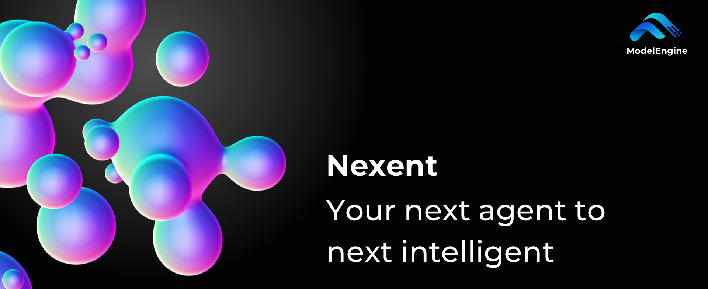

[](README.md)
[](README_CN.md)
[](https://modelengine-group.github.io/nexent)
[](https://codecov.io/gh/ModelEngine-Group/nexent-commercial?branch=develop)

Nexent 是一个零代码智能体自动生成平台 —— 无需编排，无需复杂的拖拉拽操作，使用纯语言开发你想要的任何智能体。基于MCP生态，具备丰富的工具集成，同时提供多种自带智能体，满足你的工作、旅行、生活等不同场景的智能服务需要。Nexent 还提供强大的智能体运行控制、多智能体协作、数据处理和知识溯源、多模态对话、批量扩展能力。

> 一个提示词，无限种可能。

### 🌟 立即体验 Nexent

- 🌐 访问我们的[官方网站](http://nexent.tech/)了解更多信息
- 🚀 [一键试用](http://nexent.tech/try)体验 Nexent 的强大功能

https://github.com/user-attachments/assets/b844e05d-5277-4509-9463-1c5b3516f11e

# 🤝 加入我们的社区

> *If you want to go fast, go alone; if you want to go far, go together.*

我们已经发布了 **Nexent v1**，目前功能已经相对稳定，但仍可能存在一些 bug，我们会持续改进并不断增加新功能。敬请期待，我们很快也会公布 **v2.0** 版本！

* **🗺️ 查看我们的 [功能地图](https://github.com/orgs/ModelEngine-Group/projects/6)** 探索当前和即将推出的功能。
* **🔍 试用当前版本** 并在 [问题反馈](https://github.com/ModelEngine-Group/nexent/issues) 中留下想法或报告错误。

> *Rome wasn't built in a day.*

如果我们的愿景与您产生共鸣，请通过 **[贡献指南](https://modelengine-group.github.io/nexent/zh/contributing)** 加入我们，共同塑造 Nexent。

早期贡献者不会被忽视：从特殊徽章和纪念品到其他实质性奖励，我们致力于感谢那些帮助 Nexent 诞生的先驱者。

最重要的是，我们需要关注度。请为仓库点星 ⭐ 并关注，与朋友分享，帮助更多开发者发现 Nexent —— 您的每一次点击都能为项目带来新的参与者，保持发展势头。

# ⚡ 先来试试看

### 1. 📋 系统要求  

| 资源 | 最低要求 |
|----------|---------|
| **CPU**  | 2 核 |
| **内存**  | 6 GiB   |
| **软件** | 已安装 Docker 和 Docker Compose |

### 2. 🛠️ 使用 Docker Compose 快速开始

```bash
git clone https://github.com/ModelEngine-Group/nexent.git
cd nexent/docker
cp .env.example .env # fill only nessasary configs
bash deploy.sh
```

当容器运行后，在浏览器中打开 **http://localhost:3000** 并按照设置向导操作。

# 🌱 MCP 工具生态

查看我们的[MCP 生态系统页面](https://modelengine-group.github.io/nexent/zh/mcp-ecosystem/overview.html)了解 MCP 工具生态系统的详细信息，包括社区中心、推荐工具和集成指南。

### 🚀 建议的智能体场景

查看我们的[智能体场景页面](https://modelengine-group.github.io/nexent/zh/mcp-ecosystem/use-cases.html)了解详细的智能体用例和最佳实践，包括旅行规划、研究助手、商业智能、智能生活等场景。

# ✨ 主要特性

`1` **智能体提示词自动生成**  
   将自然语言转化为可被Agent执行的提示词。Nexent可以根据你的需要自动选择正确的工具并为每个请求规划最佳执行路径。

   

`2` **可扩展数据处理引擎**  
   支持 20+ 数据格式的快速 OCR 和表格结构提取，从单进程到大规模批处理管道都能平滑扩展。

   

`3` **个人级知识库**  
   实时导入文件，自动总结，让智能体能够即时访问个人和全局知识，并了解每个知识库能提供什么。

   

`4` **互联网知识搜索**  
   连接 5+ 个网络搜索提供商，让智能体能够将最新的互联网信息与您的私有数据结合。

   

`5` **知识级可追溯性**  
   提供来自网络和知识库来源的精确引用，使每个事实都可验证。

   

`6` **多模态理解与对话**  
   说话、打字、文件或展示图片。Nexent 理解语音、文本和图片，甚至可以根据需求生成新图像。

   

`7` **MCP 工具生态系统**  
   插入或构建符合 MCP 规范的 Python 插件；无需修改核心代码即可更换模型、工具和链。

   

# 🛠️ 开发者指南

### 🤖 模型配置与模型提供商推荐

查看我们的[模型提供商页面](https://modelengine-group.github.io/nexent/zh/getting-started/model-providers.html)了解详细的模型配置指南和推荐的提供商信息。

### 🔧 开发 Nexent

想要从源代码构建或添加新功能？查看 [贡献指南](https://modelengine-group.github.io/nexent/zh/contributing) 获取分步说明。

### 🛠️ 从源码构建

想要从源码运行 Nexent？查看我们的[开发者指南](https://modelengine-group.github.io/nexent/zh/getting-started/development-guide)获取详细的设置说明和自定义选项。

# 🐛 已知问题

查看我们的[已知问题页面](https://modelengine-group.github.io/nexent/zh/known-issues.html)了解最新的问题状态和解决方案。

# 💬 社区与联系方式

- 浏览 [常见问题](https://modelengine-group.github.io/nexent/zh/faq) 了解常见安装问题。  
- 加入我们的 [Discord 社区](https://discord.gg/tb5H3S3wyv) 与其他开发者交流并获取帮助！
- 在 [GitHub Issues](https://github.com/ModelEngine-Group/nexent/issues) 中提交错误报告或功能建议。

# 📄 许可证

Nexent 采用 [MIT](LICENSE) 许可证，并附有额外条件。请阅读 [LICENSE](LICENSE) 文件了解详情。
