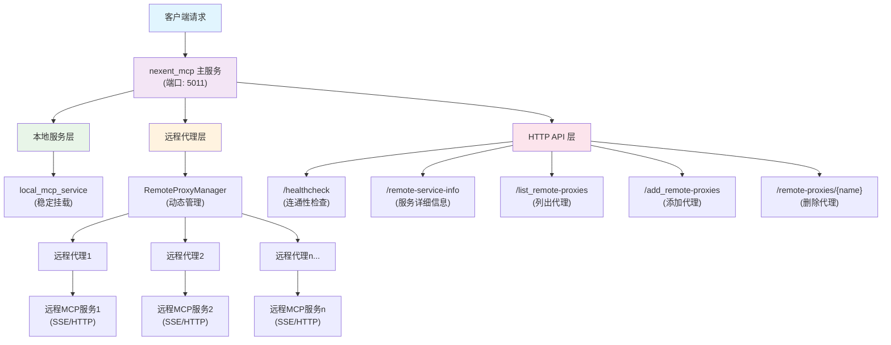

# 分层代理架构说明

## 系统架构流程图



## 架构概述

本系统实现了一个分层代理架构，将MCP服务分为两层：

1. **本地服务层**：稳定的本地mount服务，不受远程代理影响
2. **远程代理层**：动态管理的远程MCP服务代理

## 核心功能

### 1. 本地服务稳定性
- `local_mcp_service` 等本地服务始终保持稳定运行
- 远程代理的添加、删除、更新不会影响本地服务

### 2. 动态远程代理管理
- 支持动态添加、删除、更新远程MCP服务代理
- 每个远程代理作为独立的服务进行管理
- 支持多种传输方式（SSE、HTTP）

### 3. HTTP API接口
提供完整的RESTful API来管理远程代理：

#### 连通性检查
```http
GET /healthcheck?mcp_url={url}
```
快速检查远程MCP服务是否可达，返回简单的连接状态。

#### 获取服务详细信息
```http
GET /remote-service-info?mcp_url={url}
```
获取远程MCP服务的详细信息，包括工具列表、资源列表、提示列表等。

#### 列出所有远程代理
```http
GET /list-remote-proxies
```

#### 添加远程代理
```http
POST /add-remote-proxies
Content-Type: application/json

{
    "service_name": "my_service",
    "mcp_url": "http://localhost:5012/sse", 
    "transport": "sse"
}
```

#### 删除远程代理
```http
DELETE /remote-proxies/{service_name}
```

## 使用方法

### 1. 启动服务

```bash
cd backend
python nexent_mcp_service.py
```

服务将在 `http://localhost:5011` 启动。

### 2. 使用API

#### 示例：添加远程代理

```bash
curl -X POST http://localhost:5011/add-remote-proxies \
  -H "Content-Type: application/json" \
  -d '{
    "service_name": "external_service",
    "mcp_url": "http://external-server:5012/sse",
    "transport": "sse"
  }'
```

#### 示例：测试远程服务连接

```bash
# 快速连通性检查
curl "http://localhost:5011/healthcheck?mcp_url=http://external-server:5012/sse"

# 获取详细服务信息
curl "http://localhost:5011/remote-service-info?mcp_url=http://external-server:5012/sse"
```

## 代码结构

### RemoteProxyManager 类

负责管理所有远程代理的生命周期：

- `add_remote_proxy()`: 添加新的远程代理
- `remove_remote_proxy()`: 移除指定的远程代理  
- `update_remote_proxy()`: 更新现有远程代理
- `list_remote_proxies()`: 列出所有远程代理配置
- `_validate_remote_service()`: 验证远程服务连接

### API端点

- `/healthcheck`: 连通性检查端点（快速验证服务是否可达）
- `/remote-service-info`: 服务信息查询端点（获取详细的服务信息）
- `/list-remote-proxies`: 列出所有远程代理端点
- `/add-remote-proxies`: 添加远程代理端点
- `/remote-proxies/{service_name}`: 删除特定代理端点


## 错误处理

- 添加代理前会验证远程服务连接
- 提供详细的错误信息和状态码
- 支持优雅的服务卸载和重新加载

## 性能优化

- 代理服务按需加载
- 支持并发操作
- 最小化对现有服务的影响
