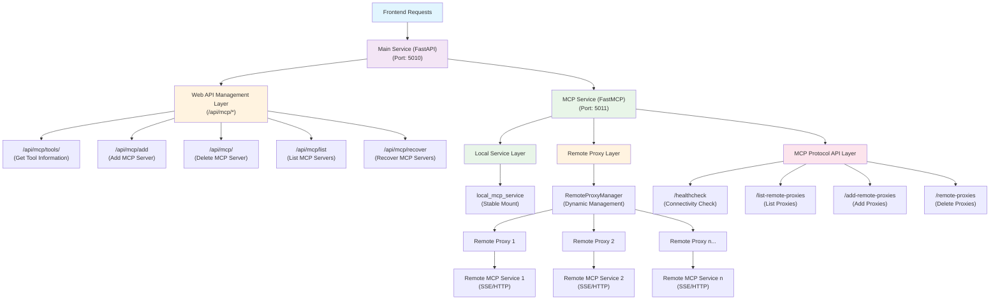
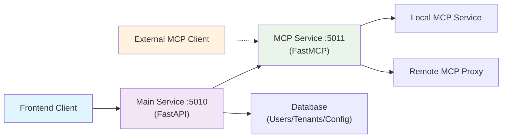
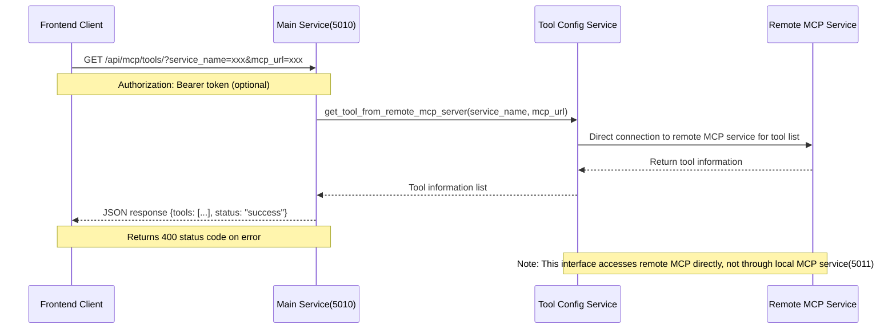
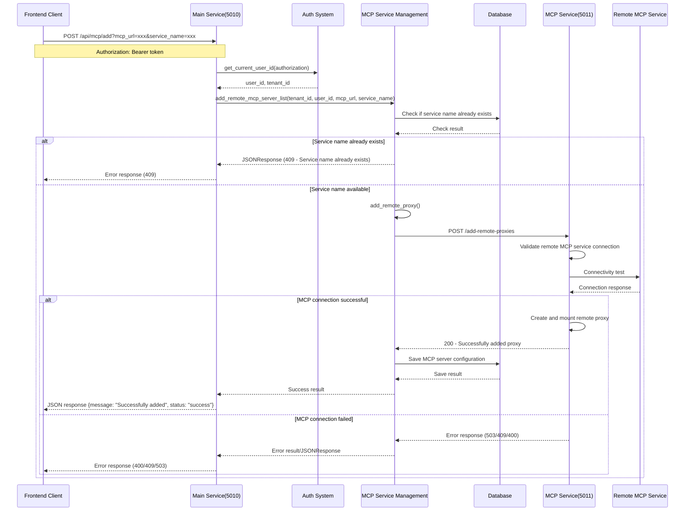
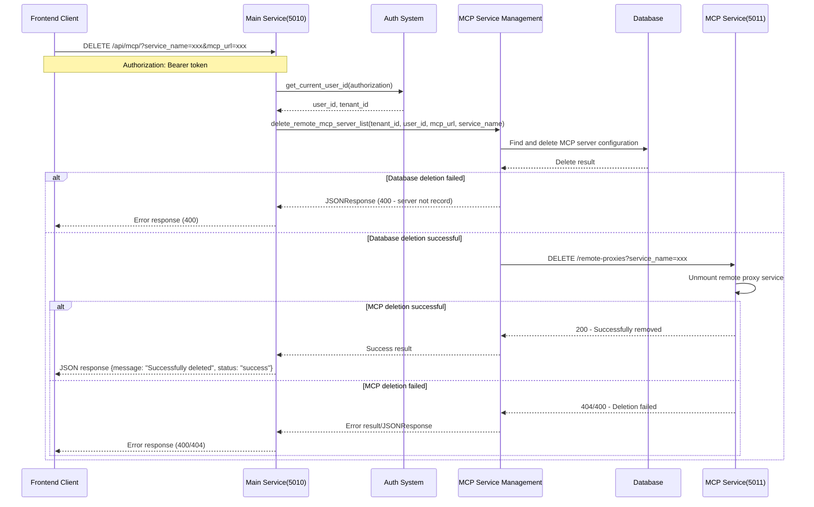
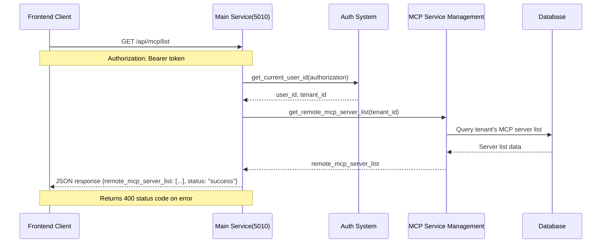
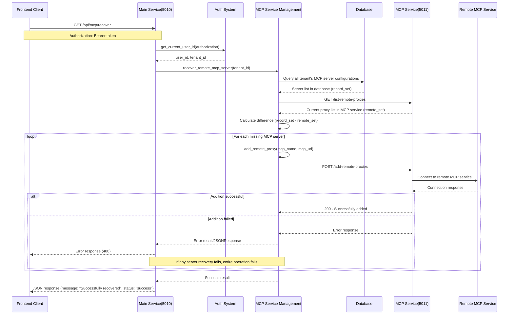

# Hierarchical Proxy Architecture Documentation

## System Architecture Flowchart



## Architecture Overview

This system implements a **dual-service proxy architecture** consisting of two independent services:

### 1. Main Service (FastAPI) - Port 5010
- **Purpose**: Provides web management interface and RESTful API, serving as the single entry point for frontend
- **Features**: User-oriented management with authentication, multi-tenant support, and proxy calls to MCP service
- **Startup File**: `main_service.py`

### 2. MCP Service (FastMCP) - Port 5011  
- **Purpose**: Provides MCP protocol services and proxy management (internal service)
- **Features**: MCP protocol standard, supports local services and remote proxies, primarily called by main service
- **Startup File**: `nexent_mcp_service.py`

**Important Note**: Frontend clients only directly access the main service (5010). All MCP-related operations are completed by the main service proxying calls to the MCP service (5011).

## Core Features

### 1. Local Service Stability
- `local_mcp_service` and other local services maintain stable operation
- Adding, removing, or updating remote proxies does not affect local services

### 2. Dynamic Remote Proxy Management
- Supports dynamic addition, removal, and updating of remote MCP service proxies
- Each remote proxy is managed as an independent service
- Supports multiple transport methods (SSE, HTTP)

### 3. Dual-Layer API Interface

#### Main Service API (Port 5010) - External Management Layer
**Interfaces directly accessed by frontend clients**, providing user-oriented management features with authentication and multi-tenant support:

**Get Remote MCP Server Tool Information**
```http
GET /api/mcp/tools/?service_name={name}&mcp_url={url}
Authorization: Bearer {token}
```

**Add Remote MCP Server**
```http
POST /api/mcp/add?mcp_url={url}&service_name={name}
Authorization: Bearer {token}
```

**Delete Remote MCP Server**
```http
DELETE /api/mcp/?service_name={name}&mcp_url={url}
Authorization: Bearer {token}
```

**Get Remote MCP Server List**
```http
GET /api/mcp/list
Authorization: Bearer {token}
```

**Recover Remote MCP Servers**
```http
GET /api/mcp/recover
Authorization: Bearer {token}
```

#### MCP Service API (Port 5011) - Internal Protocol Layer
**Internal interfaces primarily called by main service**, also available for external MCP clients:

**Connectivity Check**
```http
GET /healthcheck?mcp_url={url}
```
Quickly checks if remote MCP service is reachable, returns simple connection status.

**List All Remote Proxies**
```http
GET /list-remote-proxies
```

**Add Remote Proxy**
```http
POST /add-remote-proxies
Content-Type: application/json

{
    "service_name": "my_service",
    "mcp_url": "http://localhost:5012/sse", 
    "transport": "sse"
}
```

**Delete Remote Proxy**
```http
DELETE /remote-proxies?service_name={service_name}
```

## Usage

### 1. Starting Services

**Start Main Service**
```bash
cd backend
python main_service.py
```
Service will start at `http://localhost:5010`.

**Start MCP Service**
```bash
cd backend
python nexent_mcp_service.py
```
Service will start at `http://localhost:5011`.

### 2. Using APIs

#### Recommended Method: Managing MCP Servers via Main Service
**Frontend clients should use this method**, featuring complete authentication and permission management:

```bash
# Add remote MCP server
curl -X POST "http://localhost:5010/api/mcp/add?mcp_url=http://external-server:5012/sse&service_name=external_service" \
  -H "Authorization: Bearer {your_token}"

# Get MCP server list
curl -H "Authorization: Bearer {your_token}" \
  "http://localhost:5010/api/mcp/list"
```

#### Internal Debugging: Direct Access to MCP Service (Optional)
**For debugging or external MCP client direct integration only**:

```bash
# Test remote service connection
curl "http://localhost:5011/healthcheck?mcp_url=http://external-server:5012/sse"

# Add remote proxy
curl -X POST http://localhost:5011/add-remote-proxies \
  -H "Content-Type: application/json" \
  -d '{
    "service_name": "external_service",
    "mcp_url": "http://external-server:5012/sse",
    "transport": "sse"
  }'
```

## Code Structure

### Main Service Components (main_service.py)
- **FastAPI Application**: Provides Web API and management interface
- **Multi-tenant Support**: Multi-tenant management based on authentication
- **Router Management**: Contains routers for multiple functional modules

### MCP Service Components (nexent_mcp_service.py)

#### RemoteProxyManager Class
Responsible for managing the lifecycle of all remote proxies:
- `add_remote_proxy()`: Add new remote proxy
- `remove_remote_proxy()`: Remove specified remote proxy  
- `update_remote_proxy()`: Update existing remote proxy
- `list_remote_proxies()`: List all remote proxy configurations
- `_validate_remote_service()`: Validate remote service connection

#### MCP Protocol Endpoints
- `/healthcheck`: Connectivity check endpoint
- `/list-remote-proxies`: List all remote proxy endpoint
- `/add-remote-proxies`: Add remote proxy endpoint
- `/remote-proxies`: Delete specific proxy endpoint

### Remote MCP Management (remote_mcp_app.py)
- **Authentication Integration**: Integrated with main service authentication system
- **Data Persistence**: Supports database storage and recovery
- **Service Discovery**: Tool information acquisition and management

## Service Dependencies



## Interface Sequence Diagrams

### 1. Get Remote MCP Tool Information (GET /api/mcp/tools/)



### 2. Add Remote MCP Server (POST /api/mcp/add)



### 3. Delete Remote MCP Server (DELETE /api/mcp/)



### 4. Get Remote MCP Server List (GET /api/mcp/list)



### 5. Recover Remote MCP Servers (GET /api/mcp/recover)



## Sequence Diagram Explanation

### Interface Classification

#### 1. Direct Remote MCP Access Interfaces
- **GET /api/mcp/tools/**: Directly accesses remote MCP through tool configuration service for tool information
- Feature: Does not go through local MCP service (5011), directly connects to external MCP service

#### 2. Local MCP Service Interaction Interfaces  
- **POST /api/mcp/add**: Validates connection and adds proxy through MCP service
- **DELETE /api/mcp/**: Removes proxy through MCP service
- **GET /api/mcp/recover**: Recovers proxy connections through MCP service
- Feature: Requires interaction with local MCP service (5011), involves proxy lifecycle management

#### 3. Database-Only Interfaces
- **GET /api/mcp/list**: Directly queries database for server list
- Feature: Simplest flow, only involves database queries

### Common Flow Characteristics
1. **Authentication Flow**: Except for tool query interface, other interfaces require Bearer token authentication, obtaining user and tenant information through `get_current_user_id()`
2. **Multi-tenant Isolation**: All operations are isolated based on `tenant_id`, ensuring data security
3. **Error Handling**: Unified exception handling mechanism, returning standardized JSON error responses
4. **Proxy Architecture**: Main service acts as proxy, coordinating calls to various backend services

### Key Interaction Points
- **Authentication System**: Validates user identity and permissions
- **Database**: Stores and manages MCP server configuration information
- **MCP Service (5011)**: Handles MCP protocol interaction and proxy management
- **Tool Configuration Service**: Handles tool information acquisition
- **Remote MCP Service**: External MCP service providers

### Operation Sequence Importance
- **Add Operations**: First validate MCP connection, save to database only after success (ensures data consistency)
- **Delete Operations**: First delete database records, then remove MCP proxy (prevents data residue)
- **Recovery Operations**: Compare database and MCP service differences, supplement missing proxies

## Error Handling

- Validates remote service connection before adding proxies
- Provides detailed error information and status codes
- Supports graceful service unloading and reloading
- Dual-layer error handling: management layer and protocol layer

## Performance Optimization

- Proxy services are loaded on demand
- Supports concurrent operations
- Minimizes impact on existing services
- Loosely coupled service design

## Security Features

- **Authentication & Authorization**: Main service supports Bearer token authentication
- **Multi-tenant Isolation**: Isolated management of MCP servers for different tenants
- **Connection Validation**: Performs connectivity verification before adding remote services 