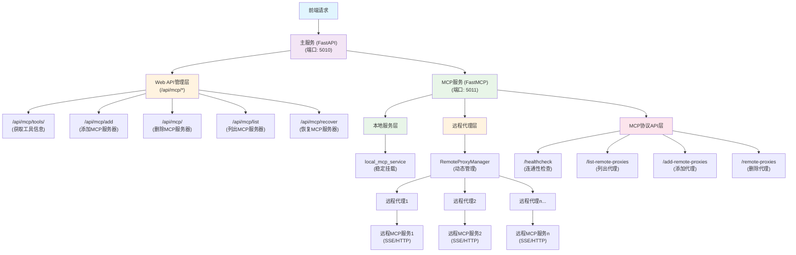
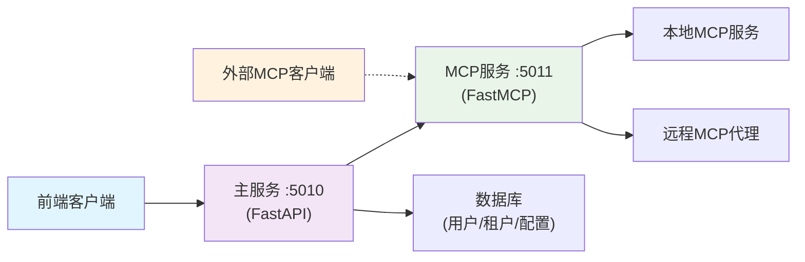
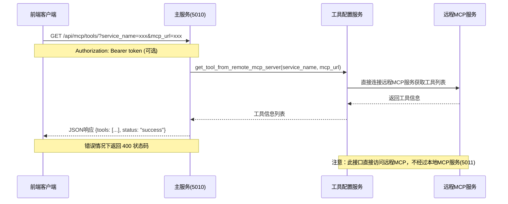
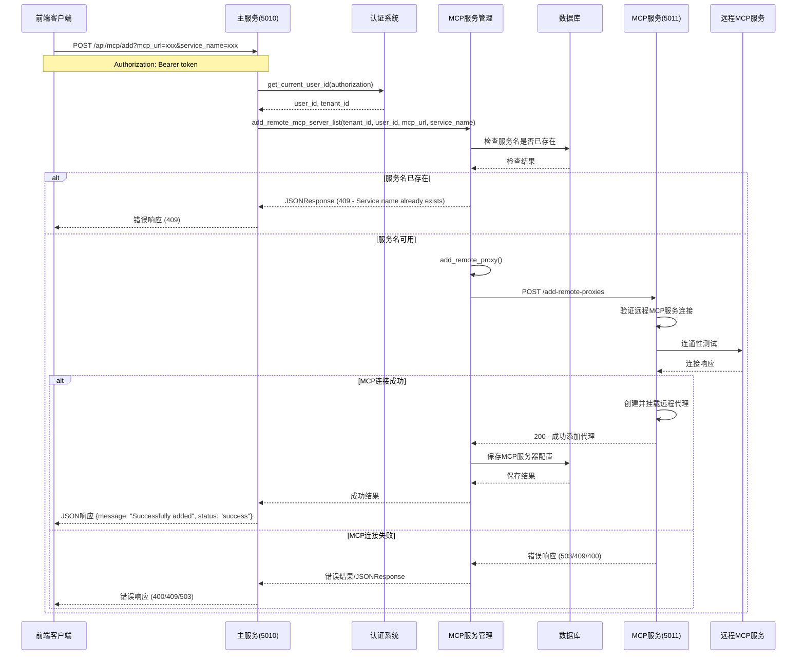
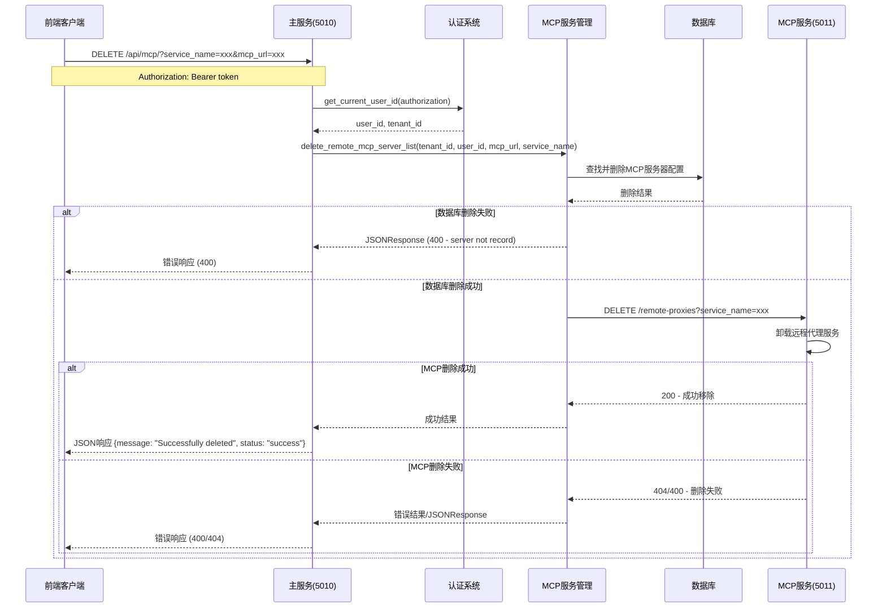
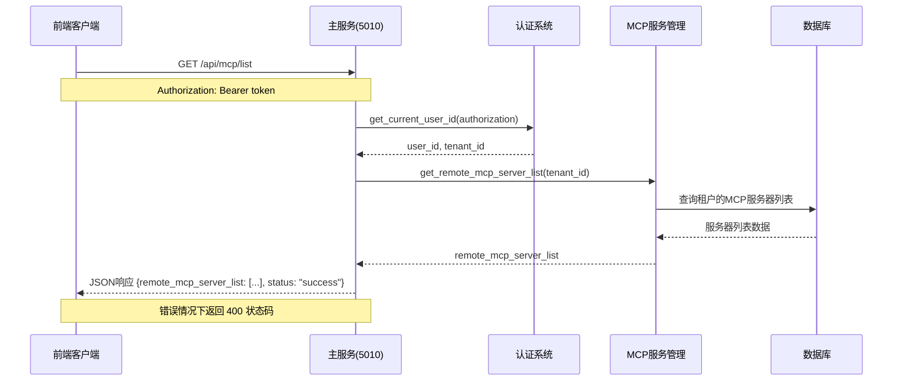
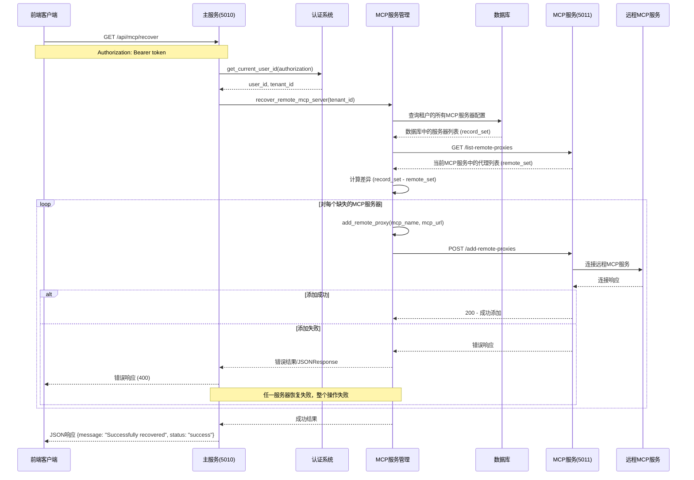

# 分层代理架构说明

## 系统架构流程图



## 架构概述

本系统实现了一个**双服务代理架构**，包含两个独立服务：

### 1. 主服务 (FastAPI) - 端口 5010
- **用途**：提供Web管理界面和RESTful API，作为前端唯一入口
- **特点**：面向用户管理，包含认证、多租户支持，代理MCP服务调用
- **启动文件**：`main_service.py`

### 2. MCP服务 (FastMCP) - 端口 5011  
- **用途**：提供MCP协议服务和代理管理（内部服务）
- **特点**：MCP协议标准，支持本地服务和远程代理，仅供主服务调用
- **启动文件**：`nexent_mcp_service.py`

**重要说明**：前端客户端仅直接访问主服务(5010)，所有MCP相关操作均由主服务代为调用MCP服务(5011)完成。

## 核心功能

### 1. 本地服务稳定性
- `local_mcp_service` 等本地服务始终保持稳定运行
- 远程代理的添加、删除、更新不会影响本地服务

### 2. 动态远程代理管理
- 支持动态添加、删除、更新远程MCP服务代理
- 每个远程代理作为独立的服务进行管理
- 支持多种传输方式（SSE、HTTP）

### 3. 双层API接口

#### 主服务API (端口 5010) - 对外管理层
**前端客户端直接访问的接口**，提供面向用户的管理功能，支持认证和多租户：

**获取远程MCP服务器工具信息**
```http
GET /api/mcp/tools/?service_name={name}&mcp_url={url}
Authorization: Bearer {token}
```

**添加远程MCP服务器**
```http
POST /api/mcp/add?mcp_url={url}&service_name={name}
Authorization: Bearer {token}
```

**删除远程MCP服务器**
```http
DELETE /api/mcp/?service_name={name}&mcp_url={url}
Authorization: Bearer {token}
```

**获取远程MCP服务器列表**
```http
GET /api/mcp/list
Authorization: Bearer {token}
```

**恢复远程MCP服务器**
```http
GET /api/mcp/recover
Authorization: Bearer {token}
```

#### MCP服务API (端口 5011) - 内部协议层
**内部接口，主要供主服务调用**，也可供外部MCP客户端直接使用：

**连通性检查**
```http
GET /healthcheck?mcp_url={url}
```
快速检查远程MCP服务是否可达，返回简单的连接状态。

**列出所有远程代理**
```http
GET /list-remote-proxies
```

**添加远程代理**
```http
POST /add-remote-proxies
Content-Type: application/json

{
    "service_name": "my_service",
    "mcp_url": "http://localhost:5012/sse", 
    "transport": "sse"
}
```

**删除远程代理**
```http
DELETE /remote-proxies?service_name={service_name}
```

## 使用方法

### 1. 启动服务

**启动主服务**
```bash
cd backend
python main_service.py
```
服务将在 `http://localhost:5010` 启动。

**启动MCP服务**
```bash
cd backend
python nexent_mcp_service.py
```
服务将在 `http://localhost:5011` 启动。

### 2. 使用API

#### 推荐方式：通过主服务管理MCP服务器
**前端客户端应使用此方式**，具备完整的认证和权限管理：

```bash
# 添加远程MCP服务器
curl -X POST "http://localhost:5010/api/mcp/add?mcp_url=http://external-server:5012/sse&service_name=external_service" \
  -H "Authorization: Bearer {your_token}"

# 获取MCP服务器列表
curl -H "Authorization: Bearer {your_token}" \
  "http://localhost:5010/api/mcp/list"
```

#### 内部调试：直接访问MCP服务（可选）
**仅用于调试或外部MCP客户端直接集成**：

```bash
# 测试远程服务连接
curl "http://localhost:5011/healthcheck?mcp_url=http://external-server:5012/sse"

# 添加远程代理
curl -X POST http://localhost:5011/add-remote-proxies \
  -H "Content-Type: application/json" \
  -d '{
    "service_name": "external_service",
    "mcp_url": "http://external-server:5012/sse",
    "transport": "sse"
  }'
```

## 代码结构

### 主服务组件 (main_service.py)
- **FastAPI应用**：提供Web API和管理界面
- **多租户支持**：基于认证的多租户管理
- **路由管理**：包含多个功能模块的路由器

### MCP服务组件 (nexent_mcp_service.py)

#### RemoteProxyManager 类
负责管理所有远程代理的生命周期：
- `add_remote_proxy()`: 添加新的远程代理
- `remove_remote_proxy()`: 移除指定的远程代理  
- `update_remote_proxy()`: 更新现有远程代理
- `list_remote_proxies()`: 列出所有远程代理配置
- `_validate_remote_service()`: 验证远程服务连接

#### MCP协议端点
- `/healthcheck`: 连通性检查端点
- `/list-remote-proxies`: 列出所有远程代理端点
- `/add-remote-proxies`: 添加远程代理端点
- `/remote-proxies`: 删除特定代理端点

### 远程MCP管理 (remote_mcp_app.py)
- **认证集成**：与主服务认证系统集成
- **数据持久化**：支持数据库存储和恢复
- **服务发现**：工具信息获取和管理

## 服务依赖关系



## 错误处理

- 添加代理前会验证远程服务连接
- 提供详细的错误信息和状态码
- 支持优雅的服务卸载和重新加载
- 双层错误处理：管理层和协议层

## 性能优化

- 代理服务按需加载
- 支持并发操作
- 最小化对现有服务的影响
- 服务间松耦合设计

## 接口时序图

### 1. 获取远程MCP工具信息 (GET /api/mcp/tools/)



### 2. 添加远程MCP服务器 (POST /api/mcp/add)



### 3. 删除远程MCP服务器 (DELETE /api/mcp/)



### 4. 获取远程MCP服务器列表 (GET /api/mcp/list)



### 5. 恢复远程MCP服务器 (GET /api/mcp/recover)



## 时序图说明

### 接口分类

#### 1. 直接访问远程MCP服务的接口
- **GET /api/mcp/tools/**：直接通过工具配置服务访问远程MCP获取工具信息
- 特点：不经过本地MCP服务(5011)，直接连接外部MCP服务

#### 2. 经过本地MCP服务的接口  
- **POST /api/mcp/add**：通过MCP服务验证连接并添加代理
- **DELETE /api/mcp/**：通过MCP服务移除代理
- **GET /api/mcp/recover**：通过MCP服务恢复代理连接
- 特点：需要与本地MCP服务(5011)交互，涉及代理的生命周期管理

#### 3. 仅操作数据库的接口
- **GET /api/mcp/list**：直接查询数据库获取服务器列表
- 特点：最简单的流程，仅涉及数据库查询

### 通用流程特点
1. **认证流程**：除了工具查询接口，其他接口都需要Bearer token认证，通过`get_current_user_id()`获取用户和租户信息
2. **多租户隔离**：所有操作都基于`tenant_id`进行隔离，确保数据安全
3. **错误处理**：统一的异常处理机制，返回标准化的JSON错误响应
4. **代理架构**：主服务作为代理，协调各个后端服务的调用

### 关键交互点
- **认证系统**：验证用户身份和权限
- **数据库**：存储和管理MCP服务器配置信息
- **MCP服务(5011)**：处理MCP协议交互和代理管理
- **工具配置服务**：处理工具信息获取
- **远程MCP服务**：外部的MCP服务提供者

### 操作顺序重要性
- **添加操作**：先验证MCP连接，成功后才保存数据库（确保数据一致性）
- **删除操作**：先删除数据库记录，再移除MCP代理（防止数据残留）
- **恢复操作**：比较数据库与MCP服务差异，补充缺失的代理

## 安全特性

- **认证授权**：主服务支持Bearer token认证
- **多租户隔离**：不同租户的MCP服务器隔离管理
- **连接验证**：添加远程服务前进行连通性验证
