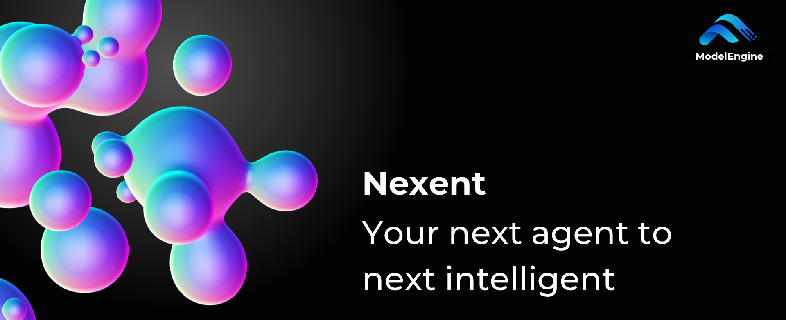

# Nexent

Nexent is a zero-code platform for auto-generating agents — no orchestration, no complex drag-and-drop required, using pure language to develop any agent you want. Built on the MCP ecosystem with rich tool integration, Nexent also provides various built-in agents to meet your intelligent service needs in different scenarios such as work, travel, and daily life. Nexent offers powerful capabilities for agent running control, multi-agent collaboration, data processing and knowledge tracing, multimodal dialogue, and batch scaling.

> One prompt. Endless reach.

## 🎬 Demo Video

<video controls width="100%" style="max-width: 800px;">
  <source src="https://github.com/user-attachments/assets/b844e05d-5277-4509-9463-1c5b3516f11e" type="video/mp4" />
  
Your browser does not support the video tag. <a href="https://github.com/user-attachments/assets/b844e05d-5277-4509-9463-1c5b3516f11e">View the demo video</a>

</video>

## 🤝 Join Our Community

> *If you want to go fast, go alone; if you want to go far, go together.*

We have released **Nexent v1**, and the platform is now relatively stable. However, there may still be some bugs, and we are continuously improving and adding new features. Stay tuned: we will announce **v2.0** soon!

* **🗺️ Check our [Feature Map](https://github.com/orgs/ModelEngine-Group/projects/6)** to explore current and upcoming features.
* **🔍 Try the current build** and leave ideas or bugs in the [Issues](https://github.com/ModelEngine-Group/nexent/issues) tab.

> *Rome wasn't built in a day.*

If our vision speaks to you, jump in via the **[Contribution Guide](../contributing)** and shape Nexent with us.

Early contributors won't go unnoticed: from special badges and swag to other tangible rewards, we're committed to thanking the pioneers who help bring Nexent to life.

Most of all, we need visibility. Star ⭐ and watch the repo, share it with friends, and help more developers discover Nexent — your click brings new hands to the project and keeps the momentum growing.

## ⚡ Quick Start

Ready to get started? Here are your next steps:

1. **📋 [Installation & Setup](./installation)** - System requirements and deployment guide
2. **🔧 [Development Guide](./development-guide)** - Build from source and customize
3. **❓ [FAQ](./faq)** - Common questions and troubleshooting

## 🌱 MCP Tool Ecosystem

Nexent is built on the Model Context Protocol (MCP) tool ecosystem, providing a flexible and extensible framework for integrating various tools and services. MCP serves as the "USB-C of AI" - a universal interface standard that allows AI agents to seamlessly connect with external data sources, tools, and services.

Learn more about the MCP ecosystem:
- **[MCP Overview](../mcp-ecosystem/overview)** - Understanding the MCP ecosystem and tools
- **[Use Cases & Scenarios](../mcp-ecosystem/use-cases)** - Real-world agent scenarios and implementations

## ✨ Key Features

Nexent offers a comprehensive set of features for building powerful AI agents:

- **🤖 Smart Agent Generation** - Zero-code agent creation using natural language
- **📊 Scalable Data Processing** - Handle 20+ file formats with intelligent extraction
- **🧠 Personal Knowledge Base** - Real-time file import with auto-summarization
- **🌐 Internet Integration** - Connect to multiple search providers and web sources
- **🔍 Knowledge Traceability** - Precise citation and source verification
- **🎭 Multimodal Support** - Voice, text, images, and file processing
- **🔧 MCP Ecosystem** - Extensible tool integration and custom development

For detailed feature information and examples, see our **[Features Guide](./features)**.

## 💬 Community & contact

Join our [Discord community](https://discord.gg/tb5H3S3wyv) to chat with other developers and get help!

## 📄 License

Nexent is licensed under the [MIT](../license) with additional conditions. Please read the [LICENSE](../license) file for details.

