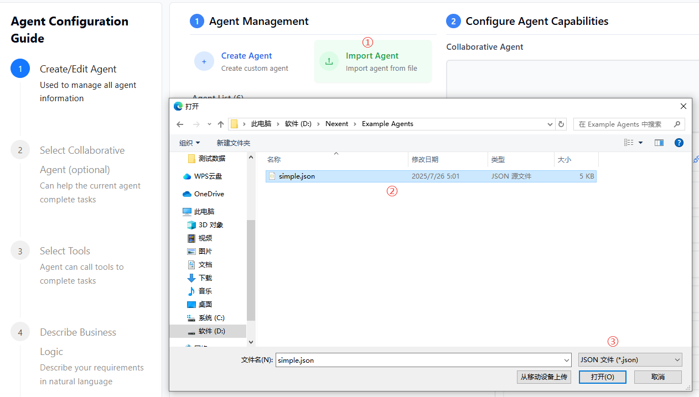
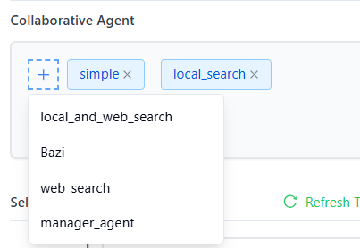
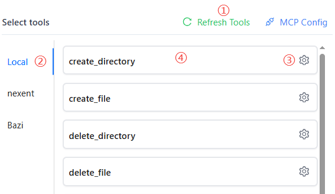
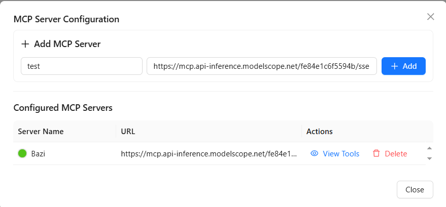
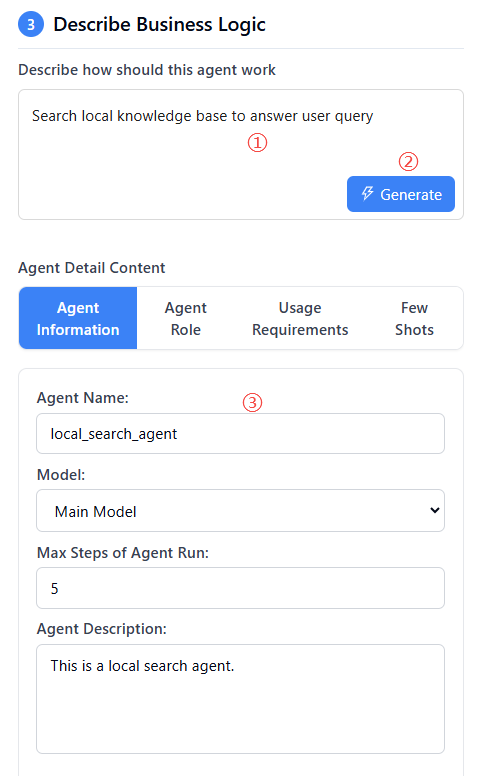

# Agent Configuration

In the Agent Configuration module, you can create, configure, and manage agents. Agents are the core feature of Nexent—they can understand your needs and perform corresponding tasks.

## 🛠️ Agent Management

### Create an Agent

On the Agent Management tab, click "Create Agent" to create a new blank agent. Click "Exit Create" to leave creation mode.

If you have an existing agent configuration, you can also import it:
1. Click "Import Agent"
2. In the popup, select the agent configuration file (JSON format)
3. Click "Open"; the system will validate the file format and content, and display the imported agent information

  

### Agent List

On the Agent Management tab, you can view all created agents. Click an agent to select it for detailed configuration; click again to deselect.

## 👥 Configure Agent Capabilities

You can configure other collaborative agents for your created agent, as well as assign available tools to empower the agent to complete complex tasks.

### Collaborative Agents

1. Click the plus sign under the "Collaborative Agent" tab to open the selectable agent list
2. Select the agents you want to add from the dropdown
3. Multiple collaborative agents can be selected
4. Click × to remove an agent from the selection

  

### Select Tools

Agents can use various tools to complete tasks, such as knowledge base search, email sending, file management, and more. They can also integrate third-party MCP tools or custom tools.

1. On the "Select Tools" tab, click "Refresh Tools" to update the available tool list
2. Select the group containing the tool you want to add
3. View all available tools under the group; click the gear icon to view tool details and configure parameters
4. Click the tool name to select/deselect it

  

### Add MCP Tools

Nexent allows you to quickly use third-party MCP tools to enrich agent capabilities.

1. On the "Select Tools" tab, click "MCP Config" to configure MCP servers in the popup and view configured servers
2. Enter the server name and URL (currently only SSE protocol is supported)
3. Click "Add" to complete the addition

  

Many third-party services such as ModelScope provide MCP services, which you can quickly integrate and use.

### Custom Tools

You can refer to the following guides to develop your own tools and integrate them into Nexent to enrich agent capabilities:
- [LangChain Tools Guide](../backend/tools/langchain)
- [MCP Tool Development](../backend/tools/mcp)
- [SDK Tool Documentation](../sdk/core/tools)

## 📝 Describe Business Logic

### Describe How should this Agent Work

Based on the selected collaborative agents and tools, you can now use concise language to describe how you want this agent to work. Nexent will automatically generate the agent’s name, description, and prompt suggestions based on your configuration and description.

1. In the "Describe should this agent work" editor, enter a brief description
2. Click "Generate"; Nexent will generate detailed agent content for you
3. You can further edit the generated content for fine-tuning

  

### Debug Agent

After completing the initial agent configuration, you can debug the agent and optimize its configuration based on the results to continuously improve agent performance.

1. In the lower right corner of the page, click the "Debug" button to open the agent debug page
2. Test conversations with the agent and observe its responses and behavior
3. Review conversation performance and error messages, and optimize the agent configuration based on the results

### Manage Agents

- **Save:** After successful debugging, click the "Save" button in the lower right corner to save the agent. The agent will then be available for selection in the chat page.
- **Export:** Export the successfully debugged agent configuration as a JSON file. When creating an agent, you can use this JSON file to create a copy via import.
- **Delete:** Delete the agent (use with caution)

## 🚀 Next Steps

After completing agent configuration, you can click "Complete Setup" to proceed to:

1. **[Chat Interface](./chat-interface)** – Interact with your agent

If you encounter any issues during agent configuration, please refer to our **[FAQ](../getting-started/faq)** or join our [Discord community](https://discord.gg/tb5H3S3wyv) for support. 