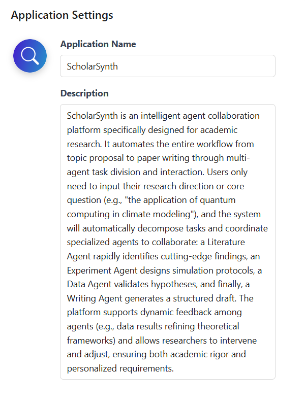

# App Configuration

In the App Configuration module, you can configure the basic information of your application, including the app icon, name, and description. Proper configuration helps improve the app’s recognition and user experience.

- The app icon and name will be displayed in the upper left corner of the chat page, helping users quickly identify the current app.
- The app description is provided to the model as background information when generating agents, enhancing the model’s understanding of the application scenario.

## 🖼️ App Icon Configuration

Click the app icon to configure it. Nexent provides two ways to set the icon:

- **Use a preset icon:** Select from the built-in icon library, choose an image and background color for quick setup.
- **Upload a custom image:** Supports PNG and JPG formats, with a file size limit of 2MB.

  
  

## 📝 App Name & Description Configuration

### App Name

- The app name is displayed in the upper left corner of the chat page, helping users quickly identify the current app.
- It is recommended to use a concise and clear name that reflects the app’s functionality. Avoid using special characters.

### App Description

- The app description is provided to the model as background information, helping it understand the application scenario.
- Highlight the core features of the app, and keep the description complete, fluent, and concise.

  

## 🚀 Next Steps

After completing the app configuration, we recommend you continue with:

1. **[Model Configuration](./model-configuration)** – Connect the AI models you need
2. **[Knowledge Base Configuration](./knowledge-base-configuration)** – Create and manage knowledge bases
3. **[Agent Configuration](./agent-configuration)** – Create and configure agents

If you encounter any issues during configuration, please refer to our **[FAQ](../getting-started/faq)** or join our [Discord community](https://discord.gg/tb5H3S3wyv) for support. 