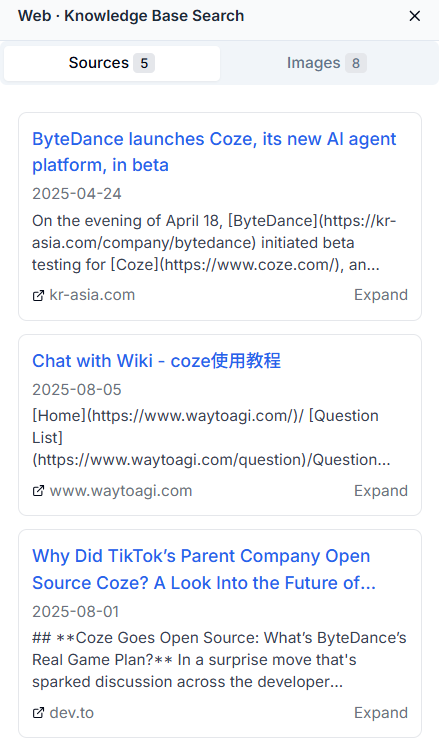

# Chat Interface

The Chat Interface is the core area for interacting with your agents. Here, you can chat with different agents, upload files, use voice input, and manage your chat history.

## 🤖 Start Chatting

### Select an Agent

Before starting a chat, you need to select an agent.

1. **View Available Agents**
   - Find the agent selection dropdown in the lower left corner of the chat box
   - Click the dropdown to view all available agents
   - Each agent displays its name and description

2. **Switch Agents**
   - Select the agent you want to chat with from the list
   - The system will automatically switch to the selected agent
   - You can start a new chat after switching

  

### Send Text Messages

After selecting an agent, you can send text messages in the following ways:

1. **Enter your question**
   - Type your question or command in the input box at the bottom of the chat box

2. **Send Message**
   - Click the send button on the right side of the input box
   - Or simply press Enter on your keyboard
   - The agent will start processing your request and generate a reply

3. **View Replies**
   - The agent’s reply will be displayed in real time in the chat area
   - The reasoning process will be shown as cards for easy distinction

  

### Use Voice Input

Nexent supports voice input, allowing you to interact with agents by speaking:

1. **Enable Voice Input**
   - Find the microphone icon in the lower right corner of the input box
   - Click the microphone icon to enable voice input
   - The first time you use it, you’ll be asked for microphone permission—please click "Allow"

2. **Start Speech Recognition**
   - After granting permission, the microphone icon will change to recording mode
   - Speak your question or command clearly
   - The system will convert your speech to text in real time and display it in the input box

3. **Complete Voice Input**
   - After speech recognition is complete, the system will automatically send the message
   - You can also manually edit the recognized text before sending
   - Both Chinese and English speech recognition are supported

> 💡 **Tip:** For better speech recognition, use it in a quiet environment and speak clearly.

### Upload Files for Chat

You can upload files during a chat, allowing agents to assist you based on file content:

1. **Choose File Upload Method**
   - Click the file upload button in the lower right corner of the input box
   - Or drag files directly into the chat area

2. **Supported File Formats**
   - **Documents:** PDF, Word (.docx), PowerPoint (.pptx), Excel (.xlsx)
   - **Text:** Markdown (.md), Plain text (.txt)
   - **Images:** JPG, PNG, GIF, and other common formats

3. **File Processing Flow**
   - The system will automatically process your uploaded files
   - Extract file content and add it to the current chat context
   - The agent will answer your questions based on the file content

4. **File-based Chat**
   - After uploading a file, you can ask questions about its content
   - The agent can analyze, summarize, or process information from the file
   - Multiple files can be uploaded and processed simultaneously

> ⚠️ **Note:** There is a file size limit for uploads. It is recommended that a single file not exceed 10MB. For large documents, upload in batches.

## 📚 Manage Your Chat History

The left sidebar provides complete chat history management:

### Create a New Chat

- Click the "New Conversation" button in the upper left corner to start a brand new conversation
- The new chat will use the currently selected agent by default, but you can change it

### View Chat List

- **Chat Titles:** The system automatically generates titles based on chat content, which you can edit at any time
- **Time Sorting:** Chats are sorted by time, showing "Today" and "Last 7 Days" records
- **Continue Chat:** Click any chat in history to view details and continue the conversation

### Manage Chat Records

1. **Edit Chat**
   - Hover over a chat title to see the "..." button on the right, click to edit
2. **Rename Chat**
   - Click "Rename" to change the chat title, press Enter to confirm
3. **Delete Chat**
   - In edit mode, you can delete unnecessary chats
   - Deletion is irreversible, please operate with caution

> 💡 **Tip:** Regularly cleaning up unnecessary chat records keeps the interface tidy and improves search efficiency.

  
  

### Access Settings Page

- In the lower left corner of the sidebar, find the ⚙️ settings icon
- Click the icon to enter the settings page, where you can modify agent and system settings

## 🔍 View Knowledge References

The right sidebar provides two tabs: "Source" and "Images" to help you understand the sources of agent responses:

### References Tab

- Shows the knowledge sources cited by the agent’s reply
- Displays text block titles and source file names
- Click "Expand" to view the full content of the text block
- Helps you understand what information the agent retrieved from your local knowledge base

- **Network Search Results**
  - Shows webpage titles and source URLs
  - Click "Expand" to view detailed content
  - Click the webpage title to jump directly to the original page

### Images Tab

- Displays related images retrieved from network search
- Click any image to preview
- Helps you visually understand relevant information

  
  

## 🎭 Multimodal Interaction Experience

### Image Processing

Nexent supports image input and processing (requires configuration of a vision model):

1. **Upload Images**
   - Drag image files directly into the chat area
   - Or click the upload button to select image files
   - Supports common formats (JPG, PNG, GIF, etc.)

2. **Image Analysis**
   - The agent will automatically analyze image content
   - It can recognize objects, text, scenes, etc. in images
   - Answers your questions based on image content

> 💡 **Tip:** Nexent will soon support richer multimodal interaction modes, including video processing, audio analysis, and more. Stay tuned!

## ⚙️ Backend Operation Mode

### Multitasking

Nexent supports backend operation mode, making you more efficient when handling complex tasks:

1. **Parallel Tasks**
   - During a chat, you can switch to other windows or applications
   - The agent will continue processing your tasks in the background
   - Processing will not be interrupted by window switching

2. **Real-time Status Monitoring**
   - Each chat in the left sidebar has a status indicator
   - 🟢 **Green dot:** Chat in progress
   - 🔵 **Blue dot:** Chat completed
   - Click any chat to view processing progress

3. **Improve Work Efficiency**
   - Backend operation mode greatly improves your work efficiency
   - You can do other work while waiting for the agent to process
   - Especially suitable for long analysis or generation tasks

## 🚀 Start Your Nexent Journey

Congratulations! You now master all the core features of Nexent. We look forward to seeing you create amazing applications with Nexent!

### Get Help

If you encounter any issues while using Nexent:

- 📖 Check our **[FAQ](../getting-started/faq)** for detailed answers
- 💬 Join our [Discord community](https://discord.gg/tb5H3S3wyv) to communicate with other users
- 🆘 Contact technical support for professional help 