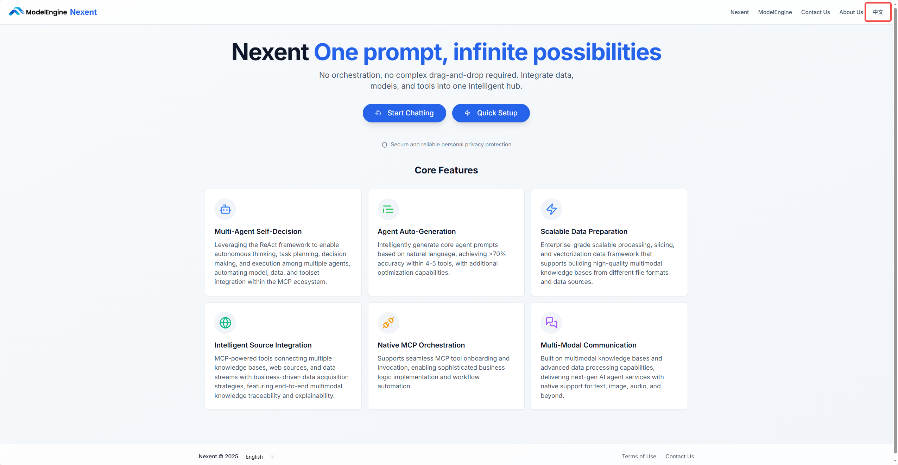

# User Guide

Nexent is a future-oriented zero-code intelligent agent development platform, dedicated to enabling everyone to easily build and deploy their own AI agents—no programming background or complex operations required!

This user guide will help you fully understand Nexent’s powerful features and usage, so you can quickly get started with all kinds of operations.

By studying this guide, you’ll be able to efficiently leverage Nexent, turning your creativity into reality and bringing true value and delight to your work and life!

## 🚀 Quick Start

On the Nexent homepage, you’ll see two main action buttons:

1. **Start Chatting:** Click to directly enter the chat page and interact with your agent.
2. **Quick Setup:** Click to enter the agent configuration page and set up your own agent.

Additionally, you can switch languages (Simplified Chinese or English) in the upper right corner of the page as needed.

## 💡 Next Steps

Ready to get started? We recommend configuring in the following order:

1. First, complete **[App Configuration](./app-configuration)** to set up your app’s basic information.
2. Then, proceed to **[Model Configuration](./model-configuration)** to connect the AI models you need.
3. Next, go to **[Knowledge Base Configuration](./knowledge-base-configuration)** to upload your documents and data.
4. After that, configure **[Agent Configuration](./agent-configuration)** to create your own agent.
5. Once everything is set, you can interact with your agent on the **[Chat Interface](./chat-interface)**.

If you encounter any issues during configuration, please refer to our **[FAQ](../getting-started/faq)** or join our [Discord community](https://discord.gg/tb5H3S3wyv) for support. 