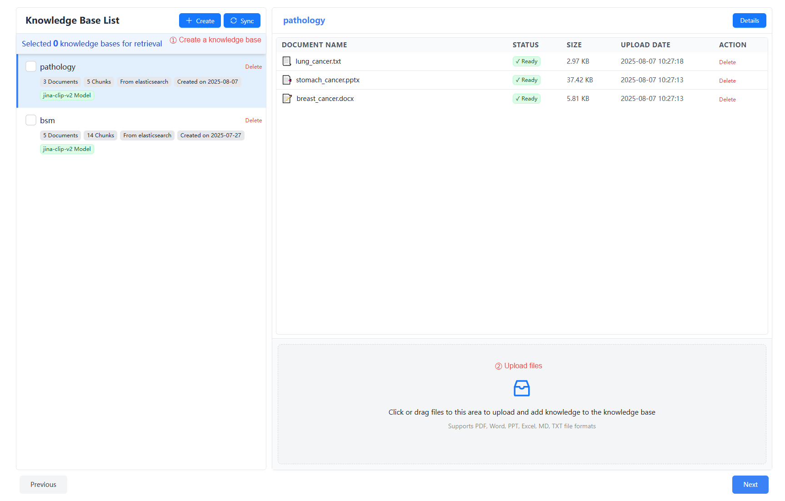
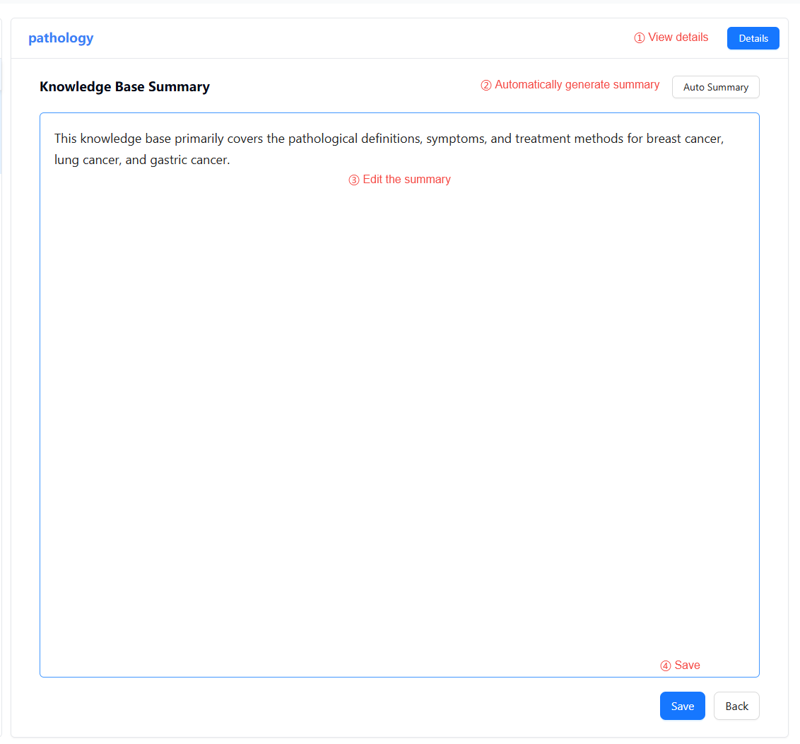
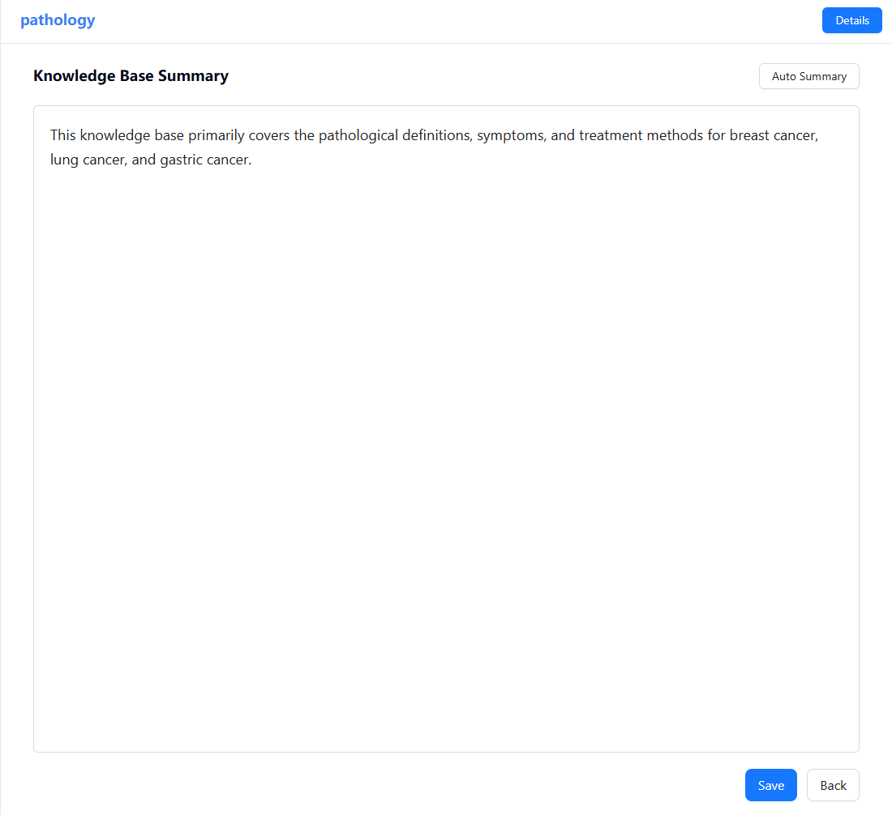
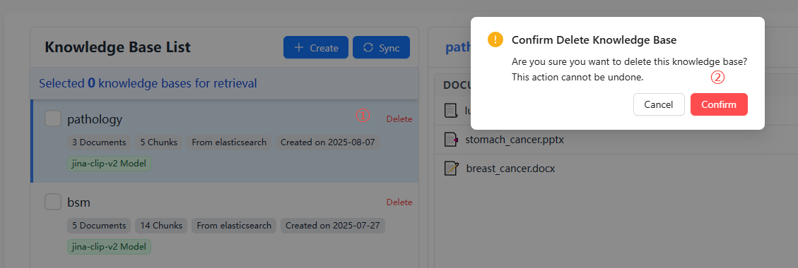

# Knowledge Base Configuration

In the Knowledge Base Configuration module, you can create and manage knowledge bases, upload files in various formats, and generate content summaries. The knowledge base is a key information source for agents, allowing them to access your private data and documents.

## 🛠️ Create a Knowledge Base

1. Click the "Create" button to create a knowledge base
2. Set an easy-to-identify name for the knowledge base (note: names must be unique)

## 📁 Upload Files

### Upload Files

1. In the knowledge base list, select the knowledge base to upload files to
2. Click the file upload area, select the files to upload (multiple selection supported), or drag files directly into the upload area
3. The system will automatically process the uploaded files, extract text content, and perform vectorization
4. You can view the processing status in the list (Processing/Forwarding/Ready)

### Supported File Formats

Nexent supports multiple file formats, including:
- **Text:** .txt, .md
- **PDF:** .pdf
- **Word:** .docx
- **PowerPoint:** .pptx
- **Excel:** .xlsx
- **Data files:** .csv

## 📊 Knowledge Base Summary

It is recommended to configure an accurate and complete summary for each knowledge base. This helps agents accurately select the appropriate knowledge base for search.

1. Click the "Details" button to view detailed content of the knowledge base
2. Click the "Auto Summary" button to automatically generate a summary
3. You can edit the generated summary for greater accuracy
4. Don’t forget to click "Save" to save your changes

> Note: The auto summary feature uses the system’s secondary model as configured in Model Configuration. If not configured, this feature will be unavailable. You can manually enter a summary for the knowledge base.

## 🔍 Knowledge Base Management

### View Knowledge Bases

1. **Knowledge Base List**
   - The left sidebar displays all created knowledge bases
   - Shows name, file count, creation time, etc.
2. **Knowledge Base Details**
   - Click a knowledge base name to view all documents in it
   - Click "Details" to view the knowledge base summary

  
  

### Edit Knowledge Bases

1. **Delete Knowledge Base**
   - Click the "Delete" button next to the knowledge base name in the right sidebar
   - Confirm the deletion (this action is irreversible)

2. **Delete/Add Files**
   - Click the knowledge base name, then click "Delete" in the file list to remove files
   - Or use the upload area below the file list to add new files

## 🚀 Next Steps

After completing knowledge base configuration, we recommend you continue with:

1. **[Agent Configuration](./agent-configuration)** – Create and configure agents
2. **[Chat Interface](./chat-interface)** – Interact with your agent

If you encounter any issues during knowledge base configuration, please refer to our **[FAQ](../getting-started/faq)** or join our [Discord community](https://discord.gg/tb5H3S3wyv) for support. 