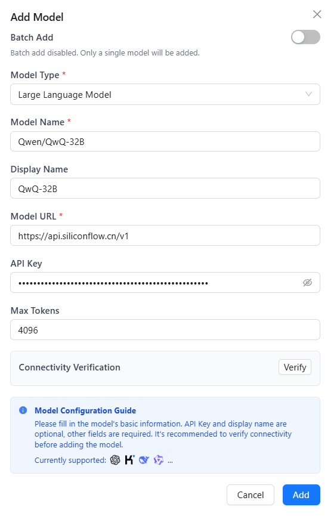
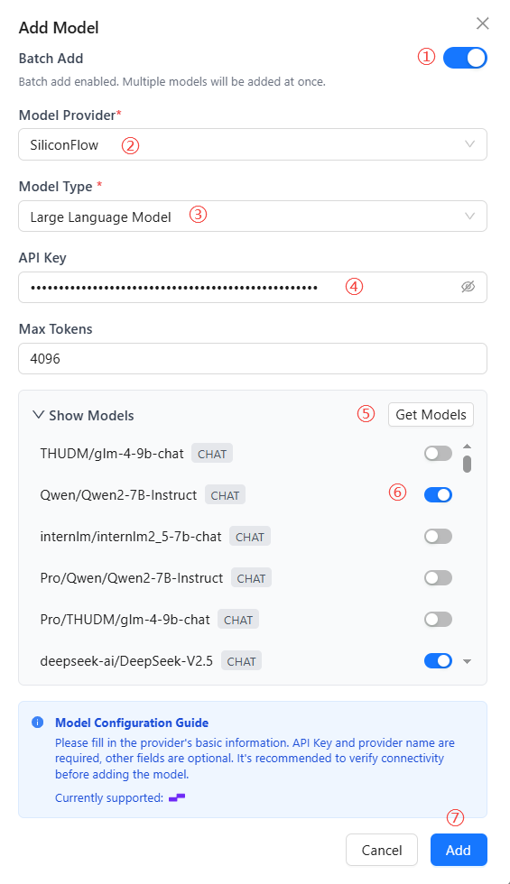
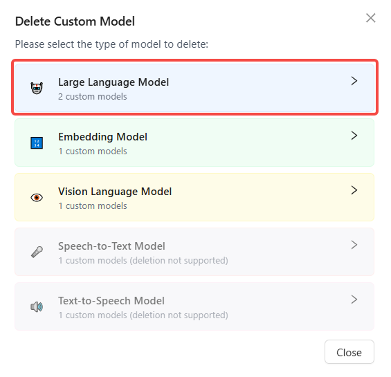
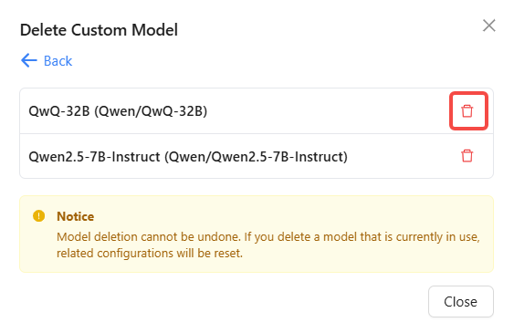
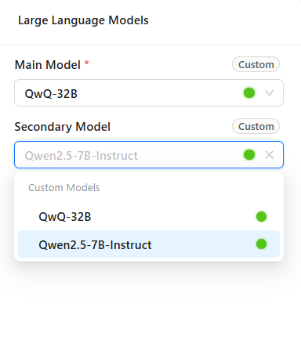
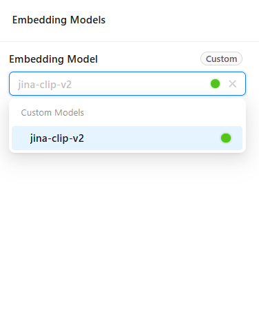
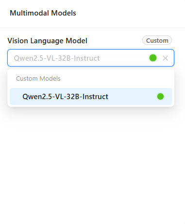

# Model Configuration

In the Model Configuration module, you can connect various types of AI models, including large language models, vector models, and vision language models. Nexent supports multiple model providers, allowing you to flexibly choose the most suitable models for your needs.

## 🔄 Sync ModelEngine Models

Nexent will soon support seamless integration with the ModelEngine platform, enabling automatic synchronization and use of all models you have deployed on ModelEngine. Stay tuned!

## 🛠️ Add Custom Models

### Add a Single Model

1. **Add a custom model**
   - Click the "Add Custom Model" button to open the add model dialog.
2. **Select model type**
   - Click the model type dropdown and select the type you want to add (Large Language Model/Embedding Model/Vision Language Model).
3. **Configure model parameters**
   - **Model Name (required):** Enter the model name as used in requests.
   - **Display Name:** Optionally set a display name for the model (defaults to the model name).
   - **Model URL (required):** Enter the API endpoint provided by the model provider.
   - **API Key:** Enter your API key.
4. **Connectivity Verification**
   - Click the "Verify" button. The system will send a test request and return the result.
5. **Save Model**
   - After configuration, click "Add" to add the model to the available models list.

  

### Batch Add Models

To improve import efficiency, Nexent provides a batch model import feature.

1. **Batch Add Models**
   - In the add model dialog, enable the batch add switch.
2. **Select Model Provider**
   - Click the model provider dropdown and select a provider.
3. **Select Model Type**
   - Click the model type dropdown and select the type you want to add (LLM/Vector/Visual).
4. **Enter API Key (required)**
   - Enter your API key.
5. **Get Models**
   - Click the "Get Models" button to retrieve a list of models.
6. **Select Models**
   - The fetched models are disabled by default. You need to manually enable the models you want to use.
7. **Save Models**
   - After configuration, click "add" to add all selected models to the available models list.

  

## 🗑️ Delete Custom Models

If you need to remove unused models, follow these steps:

1. Click the "Delete Custom Model" button.
2. Select the model type to delete (LLM/Vector/Visual).
3. Click the delete button 🗑️ to remove the selected model.

  
  

## ⚙️ Configure System Models

After adding models, you also need to properly configure system main/secondary models, embedding models, and multimodal models. These system models will be used in subsequent agents.

### Large Language Models

The system supports configuring main and secondary models for handling tasks of different complexity. The main model should be powerful, responsive, and capable to ensure core business performance. The secondary model can be cost-effective for less critical tasks.
- Click the main model dropdown to select a model from the added LLMs.
- Click the secondary model dropdown to select a model from the added LLMs.

### Embedding Models

Embedding models are mainly used for vectorizing text, images, and other data in the knowledge base, enabling efficient search and semantic understanding. Properly configuring embedding models can significantly improve search accuracy and multimodal data processing.
- Click the embedding model dropdown to select a model from the added embedding models.

### Multimodal Models

Multimodal models combine vision and language capabilities, enabling complex scenarios involving text, images, etc. For example, when uploading images in the chat page, the system will automatically use a multimodal model for content analysis and intelligent conversation.
- Click the vision-language model dropdown to select a model from the added multimodal models.

  
  
  

## ✅ Check Model Connectivity

Regularly checking model connectivity is important for stable system operation. With the connectivity check feature, you can promptly discover and resolve model connection issues, ensuring service continuity and reliability.

**Check Process:**
- Click the "Check Model Connectivity" button
- The system will automatically test the connection status of all configured system models

**Status Indicators:**
- 🔵 **Blue dot:** Checking, please wait
- 🔴 **Red dot:** Connection failed, check configuration or network
- 🟢 **Green dot:** Connection normal, model is available

**Troubleshooting Suggestions:**
- Check if the network connection is stable
- Verify that the API key is valid and not expired
- Confirm the service status of the model provider
- Check firewall and security policy settings

For detailed configuration information about model providers, please refer to our **[Model Provider Guide](../getting-started/model-providers)**.

## 🚀 Next Steps

After completing model configuration, we recommend you click "Next" to continue with:

1. **[Knowledge Base Configuration](./knowledge-base-configuration)** – Create and manage knowledge bases
2. **[Agent Configuration](./agent-configuration)** – Create and configure agents

If you encounter any issues during model configuration, please refer to our **[FAQ](../getting-started/faq)** or join our [Discord community](https://discord.gg/tb5H3S3wyv) for support. 