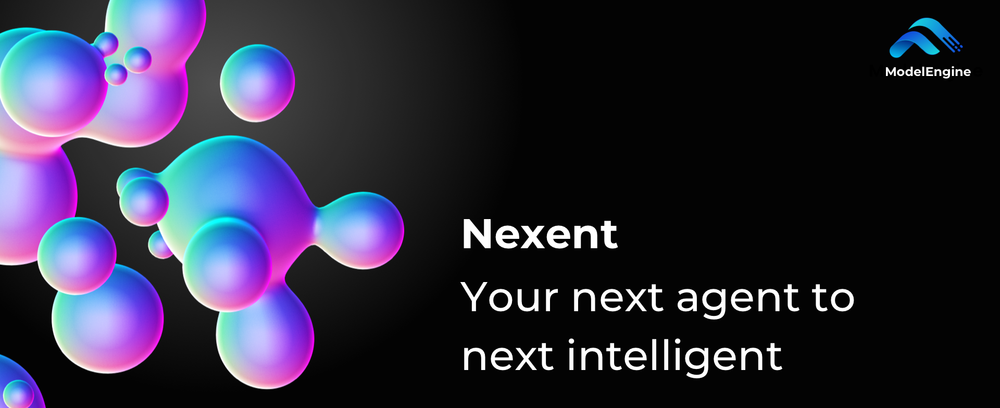

# Nexent

Nexent 是一个零代码智能体自动生成平台 —— 无需编排，无需复杂的拖拉拽操作，使用纯语言开发你想要的任何智能体。基于MCP生态，具备丰富的工具集成，同时提供多种自带智能体，满足你的工作、旅行、生活等不同场景的智能服务需要。Nexent 还提供强大的智能体运行控制、多智能体协作、数据处理和知识溯源、多模态对话、批量扩展能力。

> 一个提示词，无限种可能。

## 🎬 Demo 视频

<video controls width="100%" style="max-width: 800px;">
  <source src="https://github.com/user-attachments/assets/b844e05d-5277-4509-9463-1c5b3516f11e" type="video/mp4" />
  
您的浏览器不支持视频标签。<a href="https://github.com/user-attachments/assets/b844e05d-5277-4509-9463-1c5b3516f11e">查看演示视频</a>

</video>

## 🤝 加入我们的社区

> *If you want to go fast, go alone; if you want to go far, go together.*

我们已经发布了 **Nexent v1**，目前功能已经相对稳定，但仍可能存在一些 bug，我们会持续改进并不断增加新功能。敬请期待，我们很快也会公布 **v2.0** 版本！

* **🗺️ 查看我们的 [功能地图](https://github.com/orgs/ModelEngine-Group/projects/6)** 探索当前和即将推出的功能。
* **🔍 试用当前版本** 并在 [问题反馈](https://github.com/ModelEngine-Group/nexent/issues) 中留下想法或报告错误。

> *Rome wasn't built in a day.*

如果我们的愿景与您产生共鸣，请通过 **[贡献指南](../contributing)** 加入我们，共同塑造 Nexent。

早期贡献者不会被忽视：从特殊徽章和纪念品到其他实质性奖励，我们致力于感谢那些帮助 Nexent 诞生的先驱者。

最重要的是，我们需要关注度。请为仓库点星 ⭐ 并关注，与朋友分享，帮助更多开发者发现 Nexent —— 您的每一次点击都能为项目带来新的参与者，保持发展势头。

## ⚡ 快速开始

准备好开始了吗？以下是您的下一步：

1. **📋 [安装与配置](./installation)** - 系统要求和部署指南
2. **🔧 [开发指南](./development-guide)** - 从源码构建和自定义
3. **❓ [常见问题](./faq)** - 常见问题和故障排除

## 🌱 MCP 工具生态

Nexent 基于模型上下文协议（MCP）工具生态系统构建，为集成各种工具和服务提供了灵活且可扩展的框架。MCP 被誉为"AI 的 USB-C" - 一个通用接口标准，让 AI 智能体能够无缝连接外部数据源、工具和服务。

了解更多关于 MCP 生态系统的信息：
- **[MCP 概览](../mcp-ecosystem/overview)** - 了解 MCP 生态系统和工具
- **[用例与场景](../mcp-ecosystem/use-cases)** - 真实世界的智能体场景和实现

## ✨ 主要特性

Nexent 为构建强大的 AI 智能体提供全面的功能集：

- **🤖 智能体生成** - 使用自然语言进行零代码智能体创建
- **📊 可扩展数据处理** - 处理 20+ 种文件格式和智能提取
- **🧠 个人知识库** - 实时文件导入和自动摘要
- **🌐 互联网集成** - 连接多个搜索提供商和网络资源
- **🔍 知识溯源** - 精确引用和来源验证
- **🎭 多模态支持** - 语音、文本、图像和文件处理
- **🔧 MCP 生态系统** - 可扩展的工具集成和自定义开发

有关详细的功能信息和示例，请参阅我们的 **[功能指南](./features)**。

## 💬 社区与联系方式

加入我们的 [Discord 社区](https://discord.gg/tb5H3S3wyv) 与其他开发者交流并获取帮助！

## 📄 许可证

Nexent 采用 [MIT](../license) 许可证，并附有额外条件。请阅读 [LICENSE](../license) 文件了解详情。