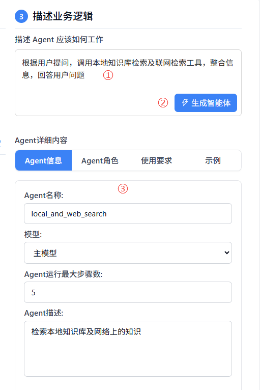

# 智能体配置

在智能体配置模块中，您可以创建、配置和管理智能体。智能体是Nexent的核心功能，它们能够理解您的需求并执行相应的任务。

## 🔧 Agent管理

### 创建智能体

在Agent管理页签下，点击“创建Agent”即可创建一个空白智能体，点击“退出创建”即可退出创建模式。
如果您有现成的智能体配置，也可以导入使用：
1. 点击“导入Agent”
2. 在弹出的文件中选择智能体配置文件（JSON 格式）
3. 点击“打开”按钮，系统会验证配置文件的格式和内容，并显示导入的智能体信息

  

### 智能体列表
在Agent管理页签下，您可以看到已创建的所有智能体列表，点击智能体会选中它以进行详细配置，再次点击则会取消选中。

## 👥 配置Agent能力

您可以为创建的智能体配置其他协作智能体，也可以为它配置可使用的工具，以赋予智能体能力完成复杂任务。

### 协作Agent

1. 点击“协作Agent页签”下的加号，弹出可选择的智能体列表
2. 在下拉列表中选择要添加的智能体
3. 允许选择多个协作智能体
4. 可点击×取消选择此智能体

  

### 选择Agent的工具
智能体可以使用各种工具来完成任务，如知识库检索、收发邮件、文件管理等本地工具，也可接入第三方MCP工具，或自定义工具。

1. 在“选择Agent的工具”页签右侧，点击“刷新工具”来刷新可用工具列表
2. 选择想要添加工具所在的分组
3. 查看分组下可选用的所有工具，可点击⚙查看工具描述，进行工具参数配置
4. 点击工具名即可选中改工具，再次点击可取消选择

  

### 添加MCP工具
Nexent支持您快速便捷地使用第三方MCP工具，丰富Agent能力。

1. 在“选择Agent的工具”页签右侧，点击“MCP配置”，可在弹窗中进行MCP服务器的配置，查看已配置的MCP服务器
2. 输入服务器名称和服务器URL（目前仅支持SSE协议）
3. 点击“添加”按钮，即可完成添加

  

有许多三方服务如modelscope提供了MCP服务，您可以快速接入使用。

### 自定义工具
您可参考以下指导文档，开发自己的工具，并接入Nexent使用，丰富Agent能力。
- [LangChain 工具指南](../backend/tools/langchain)
- [MCP 工具开发](../backend/tools/mcp)
- [SDK 工具文档](../sdk/core/tools)

## 📝 描述业务逻辑

### 描述Agent应该如何工作

根据选择的协作Agent和工具，您现在可以用简洁的语言来描述，您希望这个Agent应该如何工作。Nexent会根据您的配置和描述，自动为您生成Agent名称、描述以及提示词等信息。

1. 在“描述Agent应该如何工作”下的编辑框中，输入简洁描述
2. 点击“生成智能体”按钮，Nexent会为您生成Agent详细内容
3. 您可在下方Agent详细内容中，针对自动生成的内容进行编辑微调

  

### 调试Agent
在完成初步Agent配置后，您可以对Agent进行调试，根据调试结果微调配置，持续提升Agent表现。

1. 在页面右下角点击"调试"按钮，弹出智能体调试页面
2. 与智能体进行测试对话，观察智能体的响应和行为
3. 查看对话表现和错误信息，根据测试结果优化智能体配置

### 管理Agent

- **保存：** 在调试成功后，可点击右下角“保存”按钮，此智能体将会被保存，在后续对话页面中可以选用此智能体来进行对话。
- **导出：** 可将调试成功的Agent配置到处为JSON配置文件，在创建Agent时可以使用此JSON文件以导入的方式创建副本
- **删除：** 删除智能体（谨慎操作）

## 🚀 下一步

完成智能体配置后，您可以点击“完成配置”按钮，进入：

1. **[对话页面](./chat-interface)** - 与智能体进行交互

如果您在智能体配置过程中遇到任何问题，请参考我们的 **[常见问题](../getting-started/faq)** 或加入我们的 [Discord 社区](https://discord.gg/tb5H3S3wyv) 获取支持。 