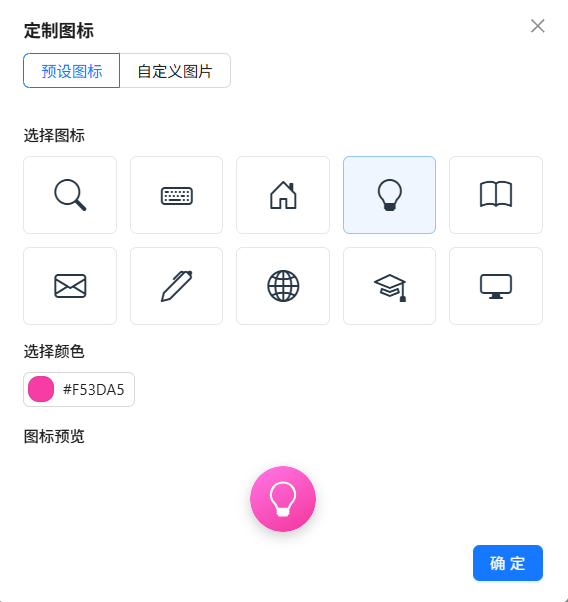
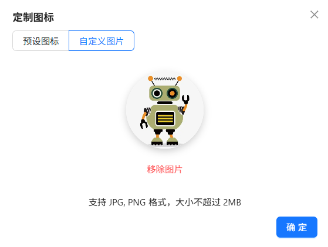
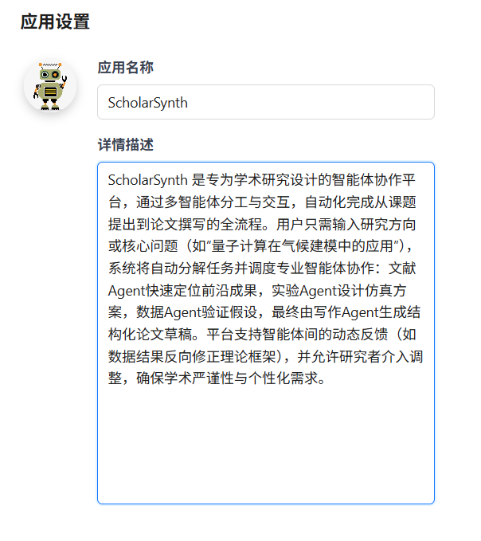

# 应用配置

在应用配置模块中，您可以配置应用的基本信息，包括应用图标、名称和描述。合理配置有助于提升应用的辨识度和用户体验。

- 应用图标和名称会展示在对话页面的左上角，帮助用户快速识别当前应用。
- 应用的描述在生成智能体时会作为背景信息提供给模型，提升模型对应用场景的理解。

## 🖼️ 应用图标配置

点击应用图标可进行图标的配置。Nexent 提供了两种图标配置方式：

- **使用预设图标**：从预设的图标库中选择，可选择图像及背景颜色，适合快速配置。
- **上传自定义图片**：支持PNG、JPG图片格式，文件大小不超过2MB。

  
  

## 📝 应用名称及描述配置

### 应用名称

- 应用名称会展示在对话页面的左上角，帮助用户快速识别当前应用。
- 建议使用简洁明了、能体现应用功能的名称，避免使用特殊字符。

### 应用描述

- 应用描述会作为背景信息提供给模型，帮助理解应用场景。
- 建议突出应用核心功能，完整流畅且简洁明了。

  

## 🚀 下一步

完成应用配置后，建议您继续配置：

1. **[模型配置](./model-configuration)** - 接入您需要的AI模型
2. **[知识库配置](./knowledge-base-configuration)** - 创建和管理知识库
3. **[智能体配置](./agent-configuration)** - 创建和配置智能体

如果您在配置过程中遇到任何问题，请参考我们的 **[常见问题](../getting-started/faq)** 或加入我们的 [Discord 社区](https://discord.gg/tb5H3S3wyv) 获取支持。 