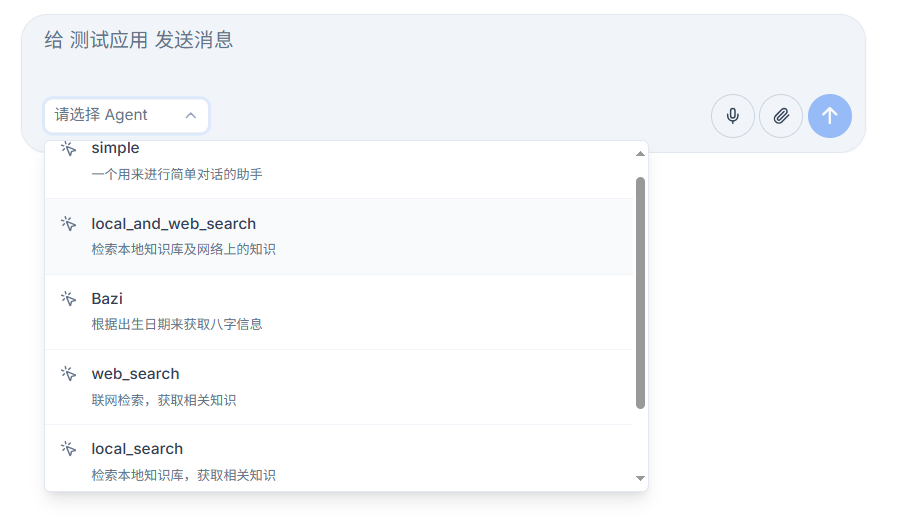
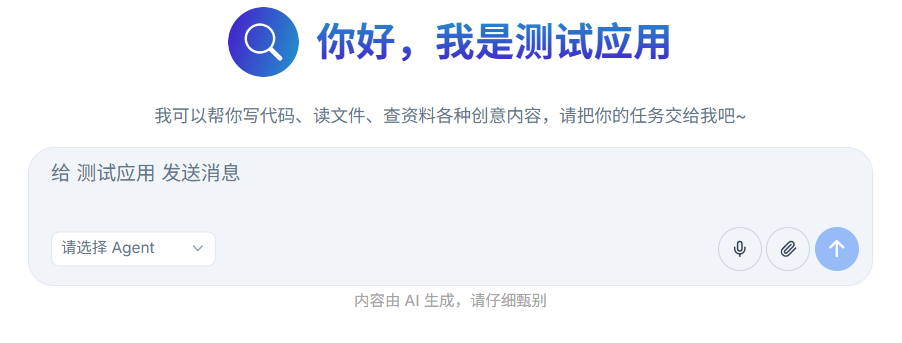
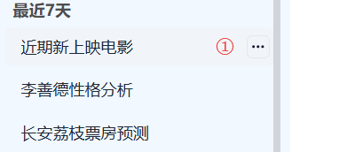
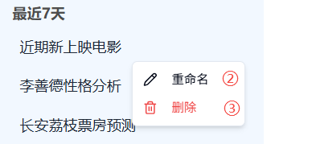
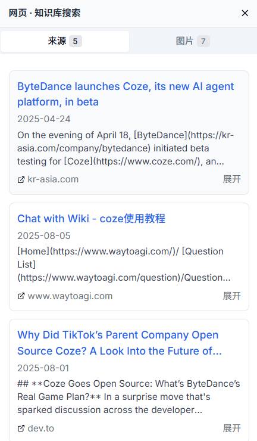
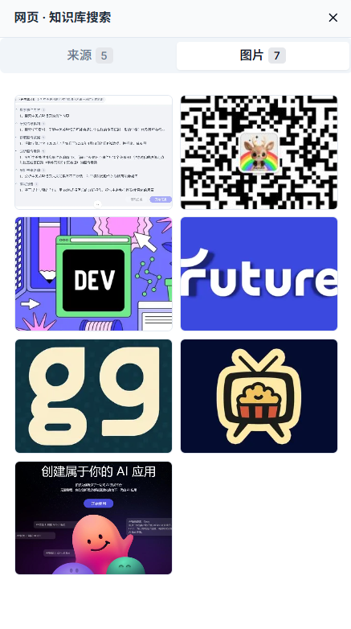

# 对话页面

对话页面是您与智能体进行交互的核心界面。在这里，您可以与不同的智能体进行对话，上传文件，使用语音输入，并管理您的对话历史。

## 🤖 开始对话

### 选择智能体

在开始对话之前，您需要先选择一个智能体。

1. **查看可用智能体**
   - 在对话框左下角找到智能体选择下拉框
   - 点击下拉框查看所有可用的智能体列表
   - 每个智能体都会显示名称和功能描述

2. **切换智能体**
   - 从列表中选择您想要对话的智能体
   - 系统会自动切换到您选中的智能体
   - 切换后即可开始新的对话

  

### 发送文本消息

选择好智能体后，您可以通过以下方式发送文本消息：

1. **输入您的问题**
   - 在对话框底部的输入框中输入您的问题或指令

2. **发送消息**
   - 点击输入框右侧的发送按钮
   - 或者直接按键盘上的Enter键发送消息
   - 智能体会开始处理您的请求并生成回复

3. **查看回复**
   - 智能体的回复会实时显示在对话区域
   - 思考过程会以卡片形式展示，便于区分

  

### 使用语音输入

Nexent支持语音输入功能，让您可以通过说话与智能体交互：

1. **启用语音输入**
   - 在输入框右下角找到麦克风图标
   - 点击麦克风图标启用语音输入功能
   - 首次使用时会请求麦克风权限，请点击“允许”授权

2. **开始语音识别**
   - 授权后，麦克风图标会变为录音状态
   - 清晰地说出您的问题或指令
   - 系统会实时将您的语音转换为文字显示在输入框中

3. **完成语音输入**
   - 语音识别完成后，系统会自动发送消息
   - 您也可以在发送前手动编辑识别结果
   - 支持中文和英文语音识别

> 💡 **小贴士**：为了获得更好的语音识别效果，请确保在安静的环境中使用，并清晰地发音。

### 上传文件进行对话

您可以在对话中上传文件，让智能体基于文件内容为您提供帮助：

1. **选择文件上传方式**
   - 点击输入框右下角的文件上传按钮
   - 或直接将文件拖拽到对话区域

2. **支持的文件格式**
   - **文档类**：PDF、Word (.docx)、PowerPoint (.pptx)、Excel (.xlsx)
   - **文本类**：Markdown (.md)、纯文本 (.txt)
   - **图片类**：JPG、PNG、GIF 等常见图片格式

3. **文件处理流程**
   - 系统会自动处理您上传的文件
   - 提取文件内容并添加到当前对话的上下文中
   - 智能体会基于文件内容回答您的问题

4. **基于文件的对话**
   - 上传文件后，您可以询问关于文件内容的问题
   - 智能体可以分析、总结或处理文件中的信息
   - 支持多文件同时上传和处理

> ⚠️ **注意事项**：上传的文件大小有限制，建议单个文件不超过10MB。对于大型文档，建议分批上传。

## 📚 管理您的对话历史

左侧边栏提供了完整的对话历史管理功能：

### 创建新对话

- 点击左上角的“新对话”按钮开始全新的对话
- 新对话会默认使用当前选中的智能体，您也可以修改

### 查看对话列表

- **对话标题**：系统会根据对话内容自动生成标题，您可以随时修改
- **时间排序**：对话按时间顺序排列，显示“今天”和“最近七天”的历史记录
- **继续对话**：点击任意历史对话即可查看详细内容并继续之前的对话

### 管理对话记录

1. **编辑对话**
   - 将鼠标悬停在对话标题上
   - 右侧会出现“...”按钮，点击可进行编辑操作

2. **重命名对话**
   - 点击“重命名”可以修改对话标题
   - 输入新的标题后按Enter确认

3. **删除对话**
   - 在编辑模式下可以删除不需要的对话
   - 删除操作不可恢复，请谨慎操作

> 💡 **小贴士**：定期清理不需要的对话记录可以保持界面整洁，提高查找效率。

  
  

### 访问配置页面

- 在左侧边栏左下角找到⚙️设置图标
- 点击图标进入配置页面，可以修改智能体配置和系统设置

## 🔍 查看知识引用来源

右侧边栏提供了“来源”和“图片”两个标签页，帮助您了解智能体回答的信息来源：

### 来源标签页

显示智能体回答所引用的知识来源：

- **本地知识库检索**
  - 显示文本块标题和来源文件名
  - 点击“展开”按钮可查看完整的文本块内容
  - 帮助您了解智能体从本地知识库中获取的信息

- **网络检索结果**
  - 显示网页标题和来源网址
  - 点击“展开”可查看引用的详细内容
  - 点击网页标题可直接跳转到原始网页

### 图片标签页

- 展示从网络检索中获取的相关图片
- 点击任意图片可进行预览
- 帮助您更直观地了解相关信息

  
  

## 🎭 多模态交互体验

### 图像处理功能

Nexent支持图像输入和处理（需要配置视觉模型）：

1. **上传图像**
   - 直接将图像文件拖拽到对话区域
   - 或点击上传按钮选择图像文件
   - 支持常见的图片格式（JPG、PNG、GIF等）

2. **图像分析能力**
   - 智能体会自动分析图像内容
   - 可以识别图像中的物体、文字、场景等元素
   - 基于图像内容回答您的问题

> 💡 **提示**：Nexent 即将支持更加丰富的多模态交互模式，包括视频处理、音频分析等功能，敬请期待！

## ⚙️ 后台运行模式

### 多任务处理功能

Nexent支持后台运行模式，让您在处理复杂任务时更加高效：

1. **多任务并行**
   - 在对话进行过程中，您可以切换到其他窗口或应用程序
   - 智能体会在后台继续处理您的任务
   - 不会因为切换窗口而中断处理

2. **实时状态监控**
   - 在左侧对话列表中，每个对话前都有状态指示器
   - 🟢 **绿色圆点**：表示对话正在进行中
   - 🔵 **蓝色圆点**：表示对话已执行完毕
   - 您可以随时点击对话查看处理进展

3. **提升工作效率**
   - 后台运行模式大大提升了您的工作效率
   - 可以在等待智能体处理的同时进行其他工作
   - 特别适合处理需要长时间分析或生成的任务

## 🚀 开始您的 Nexent 之旅

恭喜！现在您已经掌握了Nexent的所有核心功能。期待您使用Nexent创造出令人惊艳的应用！

### 获取帮助

如果您在使用过程中遇到任何问题：

- 📖 查看 **[常见问题](../getting-started/faq)** 获取详细解答
- 💬 加入我们的 [Discord 社区](https://discord.gg/tb5H3S3wyv) 与其他用户交流
- 🆘 联系技术支持获取专业帮助