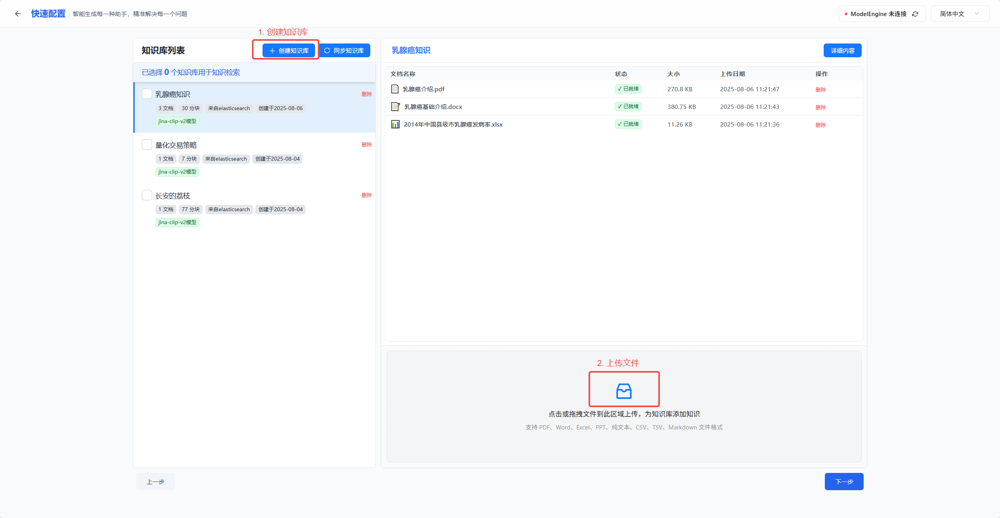
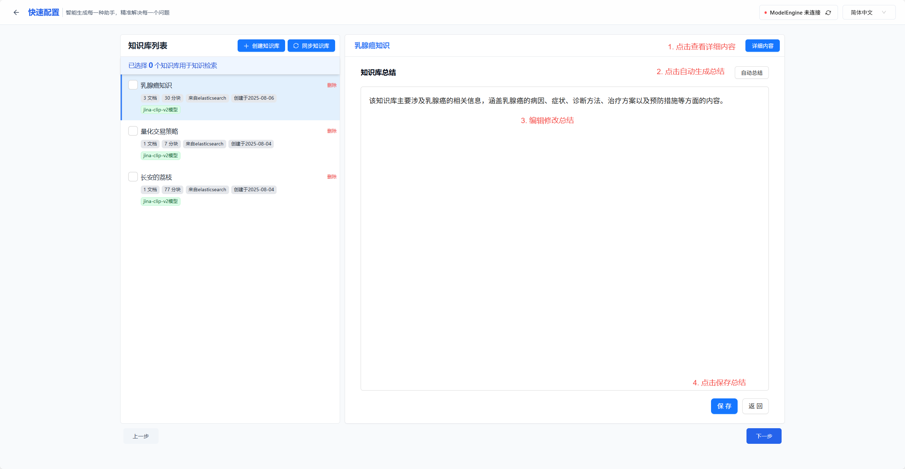
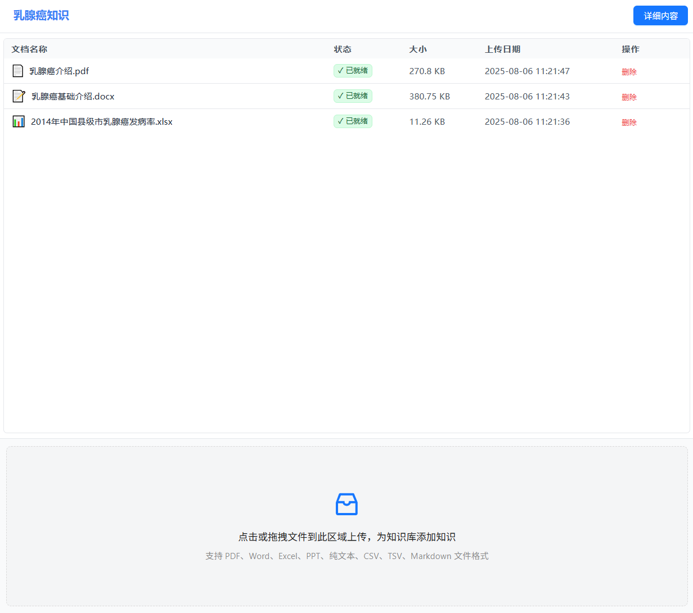
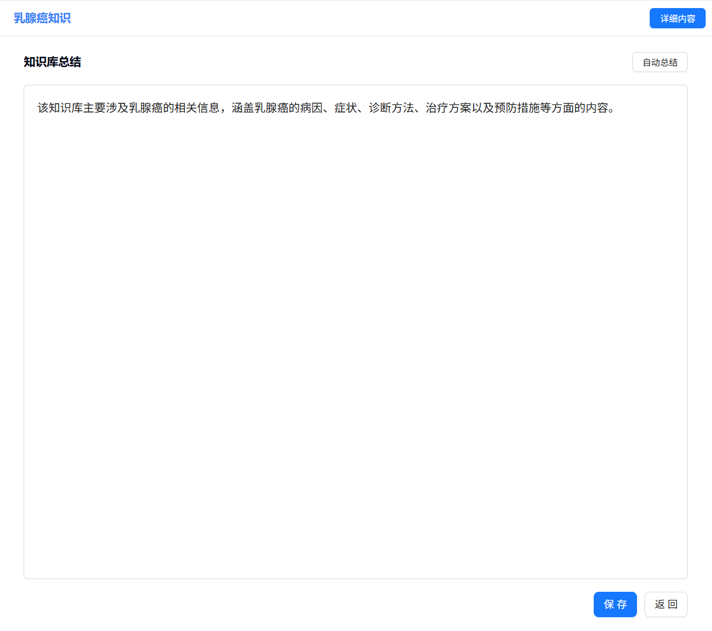
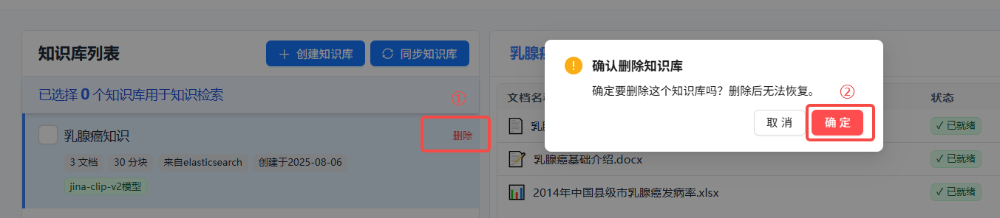

# 知识库配置

在知识库配置模块中，您可以创建和管理知识库，上传各种格式的文件，并生成内容总结。知识库是智能体的重要信息来源，让智能体能够访问您的私有数据和文档。

## 🔧 创建知识库

1. 点击“创建知识库”按钮
2. 为知识库设置一个易于识别的名称，注意知识库名称不能重复

## 📁 上传文件

### 上传文件

1. 在知识库列表中选择要上传文件的知识库
2. 点击文件上传区域，选择要上传的文件（支持多选），或直接拖拽文件到上传区域
3. 系统会自动处理上传的文件，提取文本内容并进行向量化
4. 可在列表中查看文件的处理状态（解析中/入库中/已就绪）

### 支持的文件格式

Nexent支持多种文件格式，包括：
- **文本**: .txt, .md文件
- **PDF**: .pdf文件
- **Word**: .docx文件
- **PowerPoint**: .pptx文件
- **Excel**: .xlsx文件
- **数据文件**: .csv文件

## 📊 知识库总结

建议您为每个知识库配置准确且完整的总结描述，这有助于后续智能体在进行知识库检索时，准确选择合适的知识库进行检索。

1. 点击“详细内容”按钮进入知识库详细内容查看界面
2. 点击“自动总结”按钮为知识库自动生成内容总结
3. 您可对生成的内容总结进行编辑修改，使其更准确
4. 最后记得点击“保存”将您的修改保存

注意，知识库自动总结功能默认使用在模型配置中配置的系统副模型，若未配置则此功能不可用，您可为知识库手动输入内容总结。

## 🔍 知识库管理

### 查看知识库

1. **知识库列表**
   - 知识库页面左侧展示了所有已创建的知识库
   - 显示知识库名称、文件数量、创建时间等信息

2. **知识库详情**
   - 点击知识库名称，可查看知识库中全部文档信息
   - 点击“详细内容”，可查看知识库的内容总结

  
  

### 编辑知识库

1. **删除知识库**
   - 点击知识库名称右侧“删除”按钮
   - 确认删除操作（此操作不可恢复）

2. **删除/新增文件**
   - 点击知识库名称，在文件列表中点击“删除”按钮，可从知识库中删除文件
   - 点击知识库名称，在文件列表下方文件上传区域，可新增文件到知识库中

## 🚀 下一步

完成知识库配置后，建议您继续配置：

1. **[智能体配置](./agent-configuration)** - 创建和配置智能体
2. **[对话页面](./chat-interface)** - 与智能体进行交互

如果您在知识库配置过程中遇到任何问题，请参考我们的 **[常见问题](../getting-started/faq)** 或加入我们的 [Discord 社区](https://discord.gg/tb5H3S3wyv) 获取支持。 