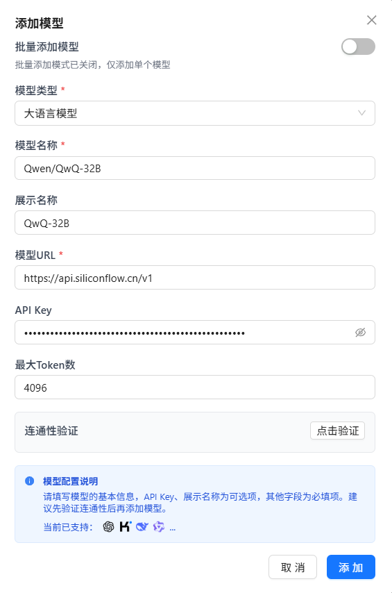
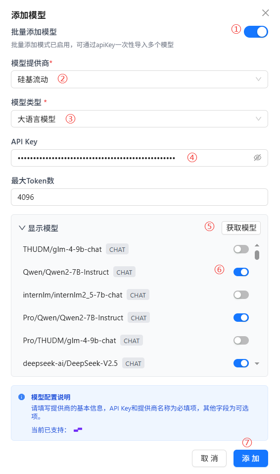
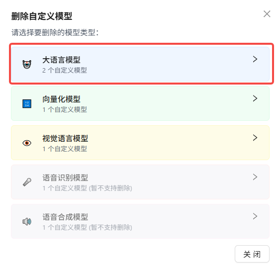
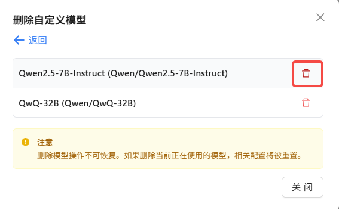
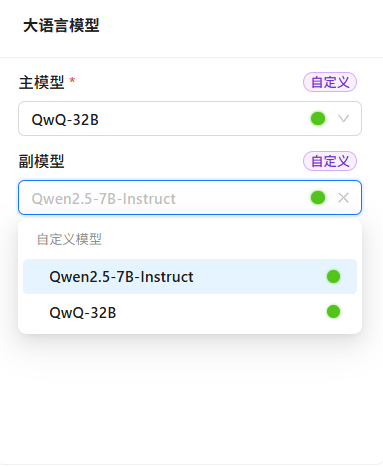
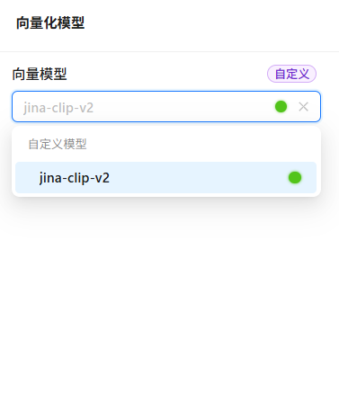
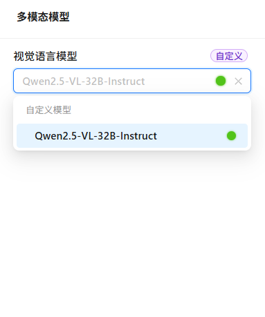

# 模型配置

在模型配置模块中，您可以接入各类AI模型，包括大语言模型、向量模型和视觉模型。Nexent支持多种模型提供商，帮助您根据实际需求灵活选择最适合的模型。

## 🔄 同步ModelEngine模型

Nexent即将支持与ModelEngine平台的无缝对接，届时可自动同步并使用您在ModelEngine上部署的所有模型，敬请期待！

## 🛠️ 添加自定义模型

### 添加单个模型

1. **添加自定义模型**
   - 点击“添加自定义模型”按钮，进入添加模型弹窗。
2. **选择模型类型**
   - 点击模型类型下拉框，选择要添加的模型类型（大语言模型/向量化模型/视觉模型）。
3. **配置模型参数**
   - **模型名称（必填）**：输入请求体中的模型名称。
   - **展示名称**：可为模型设置一个展示名称，默认与模型名称相同。
   - **模型URL（必填）**：输入模型提供商的API端点。
   - **API Key**：输入您的API密钥。
4. **连通性验证**
   - 点击“连通性验证”按钮，系统会发送测试请求并返回验证结果。
5. **保存模型**
   - 配置完成后，点击“确定”按钮，模型将被添加到可用模型列表中。

  

### 批量添加模型

为了提升模型导入效率，Nexent提供了批量模型导入功能。

1. **批量添加模型**
   - 在添加模型弹窗中，打开批量添加模型开关。
4. **选择模型提供商**
   - 点击模型提供商下拉框，选择模型提供商。
3. **选择模型类型**
   - 点击模型类型下拉框，选择要添加的模型类型（大语言模型/向量化模型/视觉模型）。
4. **输入API Key（必填）**
   - 输入您的API密钥。
5. **获取模型**
   - 点击“获取模型”按钮，批量获取模型列表。
6. **选择模型**
   - 获取到的模型默认是未启用的，您需要手动点击开关启用模型。
7. **保存模型**
   - 配置完成后，点击“确定”按钮，所有选中的模型将被添加到可用模型列表中。

  

## 🗑️ 删除自定义模型
当您需要清理不再使用的模型时，可以通过以下步骤删除模型：

1. 点击“删除自定义模型”按钮。
2. 选择要删除的模型类型（大语言模型/向量化模型/视觉模型）。
3. 点击删除按钮 🗑️ ，即可删除目标模型。

  
  

## ⚙️ 配置系统模型

添加模型后，您还需要合理配置系统主/副模型、向量化模型和多模态模型，这些系统模型会在后续的智能体中被使用。

### 大语言模型
系统支持配置主模型和副模型，分别用于处理不同复杂度的任务。主模型建议选择性能最强、响应速度快、理解能力优秀的大语言模型，以保证系统在核心业务场景下的表现。副模型则可选择资源消耗较低、成本更优的模型，用于处理次要任务。
- 点击主模型下拉框，从已添加的大语言模型中选择一个。
- 点击副模型下拉框，从已添加的大语言模型中选择一个。

### 向量化模型
向量化模型主要用于知识库的文本、图片等数据的向量化处理，是实现高效检索和语义理解的基础。配置合适的向量化模型，可以显著提升知识库的搜索准确率和多模态数据的处理能力。
- 点击向量模型下拉框，从已添加的向量化模型中选择一个。

### 多模态模型
多模态模型结合了视觉和语言能力，能够处理包含文本、图片等多种信息的复杂场景。例如，在对话页面上传图片文件时，系统会自动调用多模态模型进行内容解析和智能对话。
- 点击视觉语言模型下拉框，从已添加的视觉语言模型中选择一个。

  
  
  

## ✅ 检查模型连通性

定期检查模型连通性是确保系统稳定运行的重要环节。通过连通性检查功能，您可以及时发现和解决模型连接问题，保证服务的连续性和可靠性。

**检查流程**：
- 点击“检查模型连通性”按钮
- 系统将自动测试所有已配置的系统模型的连接状态

**状态指示**：
- 🔵 **蓝色圆点**：表示正在检测中，请耐心等待
- 🔴 **红色圆点**：表示连接失败，需要检查配置或网络状态
- 🟢 **绿色圆点**：表示连接正常，模型可以正常使用

**故障排查建议**：
- 检查网络连接是否稳定
- 验证API密钥是否有效且未过期
- 确认模型服务商的服务状态
- 检查防火墙和安全策略设置

有关模型提供商的详细配置信息，请参阅我们的 **[模型提供商配置指南](../getting-started/model-providers)**。

## 🚀 下一步

完成模型配置后，建议您点击“下一步”按钮，继续配置：
1. **[知识库配置](./knowledge-base-configuration)** - 创建和管理知识库。
2. **[智能体配置](./agent-configuration)** - 创建和配置智能体。

如在模型配置过程中遇到任何问题，请参考我们的 **[常见问题](../getting-started/faq)** ，或加入我们的 [Discord社区](https://discord.gg/tb5H3S3wyv) 获取支持。 